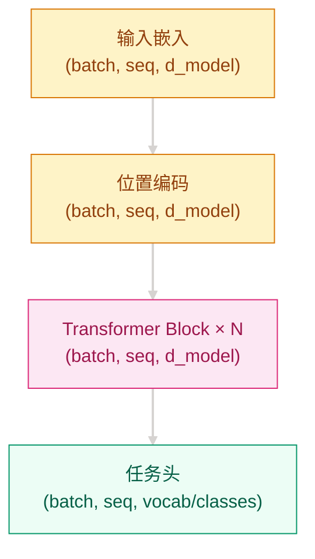

# Phase 02 Structure Alignment Implementation Plan

> **For agentic workers:** REQUIRED SUB-SKILL: Use superpowers:subagent-driven-development (recommended) or superpowers:executing-plans to implement this plan task-by-task. Steps use checkbox (`- [ ]`) syntax for tracking.

**Goal:** Align `02-Language-Transformers/` with the repository's README, code, and notebook standards without expanding content scope.

**Architecture:** Rework the chapter in three layers: README structure first, code-and-notebook standards second, and cross-file verification last. Reuse existing content wherever possible, but reorder files aggressively to match the approved template and keep Chinese and English chapter skeletons in sync.

**Tech Stack:** Markdown, Mermaid, Python, PyTorch, pytest, Jupyter Notebook JSON

---

## File Map

- `02-Language-Transformers/README.md`: Chinese phase entry rewritten into the standard chapter template while preserving timeline nodes and module navigation.
- `02-Language-Transformers/README_EN.md`: English phase entry mirrored to the Chinese structure.
- `02-Language-Transformers/recurrent-networks/README.md`: Existing near-compliant chapter updated to full 4-step implementation structure.
- `02-Language-Transformers/recurrent-networks/README_EN.md`: English mirror of the recurrent chapter structure.
- `02-Language-Transformers/attention-mechanisms/README.md`: Standardize Mermaid, step phrasing, and chapter structure.
- `02-Language-Transformers/attention-mechanisms/README_EN.md`: Rebuild to mirror the Chinese attention chapter.
- `02-Language-Transformers/transformer-architecture/README.md`: Highest-priority rewrite into the repository template.
- `02-Language-Transformers/transformer-architecture/README_EN.md`: English mirror of the transformer chapter rewrite.
- `02-Language-Transformers/pretrained-models/README.md`: Normalize 4-step progression and chapter scaffolding.
- `02-Language-Transformers/pretrained-models/README_EN.md`: English mirror of the pretrained chapter.
- `02-Language-Transformers/attention-mechanisms/src/attention.py`: File header, comment-header, and docstring-shape cleanup only.
- `02-Language-Transformers/attention-mechanisms/src/test_attention.py`: File header and path cleanup only.
- `02-Language-Transformers/attention-mechanisms/notebook.ipynb`: Reordered to the 10-cell repository notebook structure.
- `00-Timeline/README.md`: Touch only if a final consistency pass proves it necessary.

### Task 1: Rebuild Transformer Architecture Chapters

**Files:**
- Modify: `02-Language-Transformers/transformer-architecture/README.md`
- Modify: `02-Language-Transformers/transformer-architecture/README_EN.md`

- [ ] **Step 1: Snapshot the current chapter structure before rewriting**

Run:

```bash
sed -n '1,260p' 02-Language-Transformers/transformer-architecture/README.md
sed -n '1,260p' 02-Language-Transformers/transformer-architecture/README_EN.md
```

Expected: confirm that the current files lack the standard title, missing `这个问题从哪来` / `Where This Problem Came From`, and use plain text structure diagrams.

- [ ] **Step 2: Rewrite the Chinese chapter into the approved template**

Required chapter skeleton:

```md
# 为什么 [旧方法] 不够用了？—— Transformer 架构

## 这个问题从哪来
> 2017 年，...

## 学习目标
完成后你应能回答：1. ... 2. ... 3. ...

## 1. 直觉
...
> 你要记住：...

## 2. 机制
公式 → Mermaid → 4-step 渐进式实现

## 3. 工程陷阱
1. 原因 -> 现象

## 演进笔记
> 这一技术的遗产：...
→ 详见 [预训练模型](../pretrained-models/README.md)

---
**上一章**: [注意力机制](../attention-mechanisms/README.md) | **下一章**: [预训练模型](../pretrained-models/README.md)
```

- [ ] **Step 3: Replace plain text architecture diagrams with a standard Mermaid graph**

Use this style pattern:

```md

```

- [ ] **Step 4: Rebuild the English chapter to mirror the Chinese skeleton**

Required section order:

```md
# Why [Old Method] Was No Longer Enough — Transformer Architecture

## Where This Problem Came From
## Learning Goals
## 1. Intuition
## 2. Mechanism
## 3. Engineering Pitfalls
## Evolution Notes
```

- [ ] **Step 5: Verify both files contain the same structural markers**

Run:

```bash
rg -n "^## " 02-Language-Transformers/transformer-architecture/README.md
rg -n "^## " 02-Language-Transformers/transformer-architecture/README_EN.md
rg -n "你要记住|Remember this" 02-Language-Transformers/transformer-architecture/README.md 02-Language-Transformers/transformer-architecture/README_EN.md
```

Expected: matching section counts, at most 3 reminder callouts per file, and no remaining plain text diagram section.

- [ ] **Step 6: Commit the transformer chapter rewrite**

```bash
git add 02-Language-Transformers/transformer-architecture/README.md 02-Language-Transformers/transformer-architecture/README_EN.md
git commit -m "docs: align transformer architecture chapters"
```

### Task 2: Rebuild Phase Entry Pages

**Files:**
- Modify: `02-Language-Transformers/README.md`
- Modify: `02-Language-Transformers/README_EN.md`

- [ ] **Step 1: Preserve the current module list and timeline nodes**

Run:

```bash
sed -n '1,220p' 02-Language-Transformers/README.md
sed -n '1,220p' 02-Language-Transformers/README_EN.md
```

Expected: collect the existing module inventory and timeline-node wording before restructuring.

- [ ] **Step 2: Rewrite the Chinese phase entry into the standard chapter layout**

Required inclusions:

```md
## 这个问题从哪来
## 学习目标
## 1. 直觉
## 2. 机制
## 3. 工程陷阱
## 演进笔记
```

Keep:

```md
### [循环神经网络与 Seq2Seq](recurrent-networks/README.md)
### [注意力机制](attention-mechanisms/README.md)
### [Transformer 架构](transformer-architecture/README.md)
### [预训练模型](pretrained-models/README.md)
```

- [ ] **Step 3: Mirror the same structure in English**

Required section skeleton:

```md
## Where This Problem Came From
## Learning Goals
## 1. Intuition
## 2. Mechanism
## 3. Engineering Pitfalls
## Evolution Notes
```

- [ ] **Step 4: Reinsert the timeline table without changing node coverage**

Run:

```bash
rg -n "Word2Vec|GloVe|FastText|Transformer|ELMo|GPT-1|GPT-2|T5|RoBERTa|ALBERT|DistilBERT" 02-Language-Transformers/README.md
```

Expected: all existing node names still appear after the rewrite.

- [ ] **Step 5: Commit the phase entry rewrite**

```bash
git add 02-Language-Transformers/README.md 02-Language-Transformers/README_EN.md
git commit -m "docs: align language transformers phase entry"
```

### Task 3: Normalize Attention and Pretrained Chapters

**Files:**
- Modify: `02-Language-Transformers/attention-mechanisms/README.md`
- Modify: `02-Language-Transformers/attention-mechanisms/README_EN.md`
- Modify: `02-Language-Transformers/pretrained-models/README.md`
- Modify: `02-Language-Transformers/pretrained-models/README_EN.md`

- [ ] **Step 1: Standardize the Chinese attention chapter**

Checklist:

```md
- Mermaid uses graph TD
- Mermaid uses warm palette + gray links
- "你要记住" is in blockquote form
- Step captions emphasize "解决什么问题"
- Navigation remains unchanged
```

- [ ] **Step 2: Rebuild the English attention chapter to match the Chinese order**

Required minimum structure:

```md
# Why RNN Memory Breaks on Long Sentences — Attention Mechanisms
## Where This Problem Came From
## Learning Goals
## 1. Intuition
## 2. Mechanism
## 3. Engineering Pitfalls
## Evolution Notes
```

- [ ] **Step 3: Normalize the Chinese pretrained chapter to a 4-step progression**

Use this progression shape:

```md
Step 1  最小可运行理解任务
Step 2  边界处理或输入约束
Step 3  完整任务范式对比
Step 4  生产级选择或微调策略
```

- [ ] **Step 4: Rebuild the English pretrained chapter to mirror the Chinese structure**

Required section order:

```md
## Where This Problem Came From
## Learning Goals
## 1. Intuition
## 2. Mechanism
## 3. Engineering Pitfalls
## Evolution Notes
```

- [ ] **Step 5: Verify section parity across both chapter pairs**

Run:

```bash
rg -n "^## " 02-Language-Transformers/attention-mechanisms/README.md 02-Language-Transformers/attention-mechanisms/README_EN.md
rg -n "^## " 02-Language-Transformers/pretrained-models/README.md 02-Language-Transformers/pretrained-models/README_EN.md
```

Expected: each Chinese file and its English counterpart expose the same major sections.

- [ ] **Step 6: Commit the attention and pretrained alignment**

```bash
git add 02-Language-Transformers/attention-mechanisms/README.md 02-Language-Transformers/attention-mechanisms/README_EN.md 02-Language-Transformers/pretrained-models/README.md 02-Language-Transformers/pretrained-models/README_EN.md
git commit -m "docs: align attention and pretrained chapters"
```

### Task 4: Finish Recurrent Chapter Alignment

**Files:**
- Modify: `02-Language-Transformers/recurrent-networks/README.md`
- Modify: `02-Language-Transformers/recurrent-networks/README_EN.md`

- [ ] **Step 1: Add the missing fourth implementation step to the Chinese chapter**

Required progression:

```md
Step 1  最小循环编码
Step 2  变长序列与 padding 安全
Step 3  工程完善
Step 4  生产级稳定性或性能处理
```

- [ ] **Step 2: Mirror the same 4-step progression in English**

Required labels:

```md
Step 1  Minimal recurrent encoding
Step 2  Variable-length and padding safety
Step 3  Engineering completion
Step 4  Production-grade stability or performance
```

- [ ] **Step 3: Verify both files still respect the signature-element cap**

Run:

```bash
rg -c "你要记住" 02-Language-Transformers/recurrent-networks/README.md
rg -c "Remember this" 02-Language-Transformers/recurrent-networks/README_EN.md
```

Expected: both counts are `3` or fewer.

- [ ] **Step 4: Commit the recurrent chapter cleanup**

```bash
git add 02-Language-Transformers/recurrent-networks/README.md 02-Language-Transformers/recurrent-networks/README_EN.md
git commit -m "docs: finish recurrent chapter alignment"
```

### Task 5: Fix Python Standards in Attention Source Files

**Files:**
- Modify: `02-Language-Transformers/attention-mechanisms/src/attention.py`
- Modify: `02-Language-Transformers/attention-mechanisms/src/test_attention.py`
- Test: `02-Language-Transformers/attention-mechanisms/src/test_attention.py`

- [ ] **Step 1: Replace the multi-line file header in `attention.py` with the repository format**

Target header pattern:

```python
"""注意力机制 · 02-Language-Transformers/attention-mechanisms/src/attention.py · Scaled Dot-Product Attention 与 Multi-Head Attention 的生产级实现 · torch>=2.0"""
```

- [ ] **Step 2: Add the required three-line comment header above the core function**

```python
# 按相关性做加权聚合
# softmax(QK^T / √d_k) @ V
# 时间 O(n²d)，空间 O(n²)
def scaled_dot_product_attention(...):
```

- [ ] **Step 3: Normalize `test_attention.py` header and path wording**

Target header pattern:

```python
"""注意力机制单元测试 · 02-Language-Transformers/attention-mechanisms/src/test_attention.py · 验证注意力实现的 shape、mask 与数值性质 · torch>=2.0, pytest>=7.0"""
```

- [ ] **Step 4: Run the focused tests**

Run:

```bash
cd 02-Language-Transformers/attention-mechanisms/src && pytest test_attention.py -v
```

Expected: all existing tests pass and no behavior changes are required to satisfy formatting cleanup.

- [ ] **Step 5: Commit the Python standards cleanup**

```bash
git add 02-Language-Transformers/attention-mechanisms/src/attention.py 02-Language-Transformers/attention-mechanisms/src/test_attention.py
git commit -m "style: align attention source files"
```

### Task 6: Rebuild the Attention Notebook to the 10-Cell Format

**Files:**
- Modify: `02-Language-Transformers/attention-mechanisms/notebook.ipynb`

- [ ] **Step 1: Inspect the current notebook cell layout**

Run:

```bash
jq -r '.cells | to_entries[] | "CELL \(.key+1) \(.value.cell_type)"' 02-Language-Transformers/attention-mechanisms/notebook.ipynb
```

Expected: confirm the current notebook has 9 cells and merged responsibilities.

- [ ] **Step 2: Reorder and split cells into the repository's 10-cell notebook structure**

Required target layout:

```text
Cell 1  [MD]   标题 + 一句话说验证什么
Cell 2  [Code] 导入 + seed(42) + 环境检查
Cell 3  [MD]   ## 直觉（含公式）
Cell 4  [Code] Step 1 最小实现
Cell 5  [Code] Step 2 边界处理
Cell 6  [Code] Step 3 完整实现
Cell 7  [MD]   ## 验证
Cell 8  [Code] shape 验证 / 对比期望输出
Cell 9  [MD]   ## 可视化
Cell 10 [Code] matplotlib 图
```

- [ ] **Step 3: Validate the notebook structure after editing**

Run:

```bash
jq -r '.cells | length' 02-Language-Transformers/attention-mechanisms/notebook.ipynb
jq -r '.cells | to_entries[] | "CELL \(.key+1) \(.value.cell_type)"' 02-Language-Transformers/attention-mechanisms/notebook.ipynb
```

Expected: `10` cells, in the exact markdown/code order above.

- [ ] **Step 4: Commit the notebook restructure**

```bash
git add 02-Language-Transformers/attention-mechanisms/notebook.ipynb
git commit -m "docs: normalize attention notebook structure"
```

### Task 7: Final Consistency Pass

**Files:**
- Modify if required: `00-Timeline/README.md`

- [ ] **Step 1: Run a chapter-wide structure audit**

Run:

```bash
rg -n "^## (这个问题从哪来|学习目标|1\\. 直觉|2\\. 机制|3\\. 工程陷阱|演进笔记)$" 02-Language-Transformers --glob 'README.md'
rg -n "^## (Where This Problem Came From|Learning Goals|1\\. Intuition|2\\. Mechanism|3\\. Engineering Pitfalls|Evolution Notes)$" 02-Language-Transformers --glob 'README_EN.md'
```

Expected: every target README appears in both reports with the standard section markers.

- [ ] **Step 2: Recheck the phase timeline node coverage**

Run:

```bash
rg -n "Word2Vec|GloVe|FastText|Transformer|ELMo|GPT-1|GPT-2|T5|RoBERTa|ALBERT|DistilBERT" 02-Language-Transformers/README.md
rg -n "Word2Vec|Seq2Seq|Attention|Transformer|BERT|GPT-1|GPT-2|T5|RoBERTa|ALBERT|DistilBERT" 00-Timeline/README.md
```

Expected: no 02 chapter timeline node disappears silently; `00-Timeline/README.md` only changes if inconsistency is real and concrete.

- [ ] **Step 3: Review git diff for scope control**

Run:

```bash
git diff --stat
git diff -- 02-Language-Transformers
```

Expected: changes are limited to the approved 02 chapter scope, plus `00-Timeline/README.md` only if necessary.

- [ ] **Step 4: Commit any final timeline or consistency fix**

```bash
git add 02-Language-Transformers 00-Timeline/README.md
git commit -m "docs: finish phase-02 standards alignment"
```

