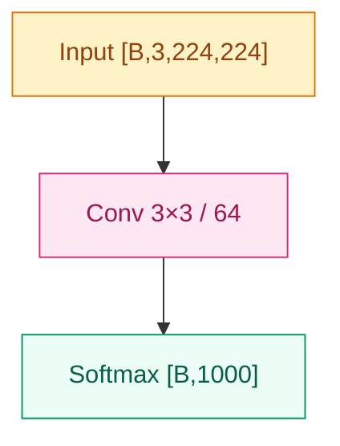
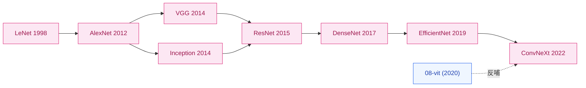

# `01-cnn` 家族内容写作 Implementation Plan

> **For agentic workers:** REQUIRED SUB-SKILL: Use superpowers:subagent-driven-development (recommended) or superpowers:executing-plans to implement this plan task-by-task. Steps use checkbox (`- [ ]`) syntax for tracking.

**Goal:** 把 spec `2026-06-07-01-cnn-content-design.md` 落地：完成 `01-cnn` 家族 6 个新节点 + 1 个家族 README，AlexNet 作为格式锚。

**Architecture:** 8 个连续任务串行执行——7 个节点按时间排序，最后 1 个家族 README，再 1 个端到端冒烟。每个节点 Task 给 subagent 完整 brief（金标本路径 + 元信息 + 事实清单 + 引用清单 + 不展开清单 + 13 项自动校验），subagent 在不读 archive 全文的前提下，照 AlexNet 节奏写出符合规范的节点。

**Tech Stack:** Markdown · Mermaid · YAML frontmatter · Python 3 · git

**Spec reference:** `docs/superpowers/specs/2026-06-07-01-cnn-content-design.md`

---

## 通用 Brief（每个节点 Task 共享，subagent 必须遵守）

### 必读锚

写节点之前必须读这两份文件，理解结构和语气：

1. **AlexNet 金标本**：`01-cnn/02-alexnet.md` —— 这是格式与语气的唯一锚。每个节点都要在结构 / 调性 / 排版上与它一致。
2. **写作风格指南**：`docs/writing-style.md`（特别 §1 节点规范、§1.6 图规范）

### 禁止

- **禁止读 `_archive/`** 任何文件（含 `_archive/tracks/vision/cnn-architectures/README.md`）。该文件里的事实素材已经被 controller 摘成事实清单写在每个 Task brief 里。读 archive 会导致旧风格污染。
- **禁止跨节点引用未来章节中尚未写出的工作** 的具体内容（只引用文件路径，不引用内容）

### 风格规则要点（精简版，详见 `docs/writing-style.md`）

| 规则 | 强制？ |
|---|---|
| `## 之前卡在哪` 用因果叙述（现象 + 数字 + 共识），禁止"X 提出了 Y"句式 | 强制 |
| `## 影响 / 后续` 以 `→ 链接` 结尾，至少 2 个 | 强制 |
| 公式先于代码 | 强制 |
| `> 你要记住：...` blockquote 用 0–2 次 | 鼓励 |
| H1 用 `# 工作名 (年份)` 中性标题 | 鼓励（疑问句仅在替代关系成立时） |
| 不复制 foundations 内容，用相对链接 | 强制 |

### 引用 foundations 规则

每个节点至少链 1 处 `../foundations/`。常用的有：

- `../foundations/01-neural-network-basics/` — 反向传播、链式法则
- `../foundations/02-activations/` — ReLU/GELU/Swish
- `../foundations/03-optimizers/` — SGD/Adam
- `../foundations/04-normalization/` — BatchNorm/LayerNorm
- `../foundations/05-initialization/` — He/Xavier
- `../foundations/07-regularization/` — Dropout

### Mermaid 模板（必照此调）



约束：

- 计算节点必含 op + 关键超参（如 `Conv 3×3 / 64`、`FC 4096`）
- input/output 节点必含 tensor shape
- `classDef` 颜色按上面三类（input/compute/output）

每张图下方紧跟一行 caption：`*图 N：...*`（≤ 30 字，说"看什么"）。

### 提交规范

每个 Task 收尾：

```bash
cd /Users/lauzanhing/Desktop/Daily-LLM
git add 01-cnn/<file>.md TIMELINE.md
git commit -m "feat(01-cnn): add <NodeName> node"
```

TIMELINE.md 在每个 Task 后必须重生成（`python3 scripts/generate_timeline.py`）。

### 自动校验（每个节点 Task 内嵌的 13 项 grep）

每个 Task 写完后必跑：

```bash
F=01-cnn/<file>.md
echo "=== 1. H1 中性 ===" && head -12 $F | grep -nE "^# [A-Za-z0-9 /]+\\([0-9]{4}\\)"
echo "=== 2. frontmatter 7 字段 ===" && head -10 $F | grep -cE "^(name|year|family|order|paper|authors|key_idea):"
echo "=== 3. 你要记住 0-2 次 ===" && grep -c "^> 你要记住" $F
echo "=== 4. 影响后续 ≥ 2 个 → 链接 ===" && awk '/^## 影响/{flag=1;next}/^## /{flag=0}flag' $F | grep -c "^→"
echo "=== 5. foundations 引用 ≥ 1 ===" && grep -cE "foundations/(0[1-9]-)" $F
echo "=== 6. 图配额 mermaid 数量 ===" && grep -cE "^\`\`\`mermaid" $F
echo "=== 7. 图 caption 数量 ===" && grep -cE "^\*图 [0-9]+：" $F
echo "=== 8. 长度 ===" && python3 -c "import re; t=open('$F').read(); print('est_total=', len(re.findall(r'[一-鿿]',t)) + len(re.findall(r'[A-Za-z]+',t)))"
echo "=== 9 关键代码块存在 ===" && grep -cE "^\`\`\`python" $F
echo "=== 10. 不展开块校验（按 brief 列出的）===" && <brief 内具体 grep>
echo "=== 11. 展开块校验（按 brief 列出的）===" && <brief 内具体 grep>
echo "=== 12. 应含的事实关键词（按 brief 列出）===" && <brief 内具体 grep>
echo "=== 13. TIMELINE 重生成 ===" && python3 scripts/generate_timeline.py
```

通过条件：

- 1: 命中
- 2: 7
- 3: 0–2
- 4: ≥ 2
- 5: ≥ 1
- 6: 满足该节点图配额（1 概念引入型/标准 = 1；大事件 ≥ 2）
- 7: = #6（每张图都有 caption）
- 8: 在节点字数目标 [下限×0.7, 上限×1.3]
- 9: ≥ 1（节点都有关键代码）
- 10/11/12: 按 brief
- 13: 重生成成功

任意 FAIL 必须修内容再 commit。

---

### Task 1: 写 LeNet (1998)

**Files:**
- Create: `01-cnn/01-lenet.md`
- Modify: `TIMELINE.md`（脚本重生成）

#### Brief

**节点元信息：**

| 字段 | 值 |
|---|---|
| 类型 | 1 概念引入型 |
| 字数目标 | 800–1500（容差 560–1950） |
| 图配额 | ≥ 1 Mermaid 架构图 |
| 不展开 | `### 直觉` / `### 机制` / `## 工程陷阱` / `## 训练细节` 全部不展开 |
| 展开 | 只有 4 必填章节 |

**frontmatter（写入文件顶部，逐字符）：**

```yaml
---
name: "LeNet-5"
year: 1998
family: "01-cnn"
order: 1
paper: "Gradient-Based Learning Applied to Document Recognition"
authors: ["Yann LeCun", "Léon Bottou", "Yoshua Bengio", "Patrick Haffner"]
key_idea: "把卷积+池化+全连接这套范式第一次系统化定义出来，在手写数字识别上跑通"
---
```

H1：`# LeNet-5 (1998)`

**事实清单（必须以某种方式融入正文，不要照抄）：**

- LeNet-5 是 Yann LeCun 1989 起持续研究、1998 综述定型的网络。被部署在美国邮政编码 / 银行支票识别。
- 输入 32×32 灰度图（MNIST 是 28×28 zero-pad 到 32），输出 10 类
- 结构：C1(6@28×28) → S2(6@14×14) → C3(16@10×10) → S4(16@5×5) → C5(120) → F6(84) → output(10)
- 卷积核 5×5，池化是平均池化（不是 max pool），激活是 tanh（不是 ReLU）
- C3 用了"部分连接表"（非全连接，节省参数），10/16 通道只连前面 6 通道的子集
- 输出层用 RBF（径向基），不是 softmax；损失是 MSE 的变体
- 大约 60K 参数（vs AlexNet 60M，差 1000 倍）
- 当时的瓶颈不是算法，是数据规模（手写数字勉强够）和算力
- LeCun 同期工作还有早期的 Boltzmann/Hopfield，CNN 这条路在 90 年代被 SVM 风头压过

**调性提示（subagent 写作时拿捏）：**

- LeNet 是史前史 + 奠基。**没有"被前作逼出来"**——它在 MLP 时代直接开了 CNN 这条路。因此 `## 之前卡在哪` 应该讲"在 LeNet 之前，全连接网络把图像压平丢失邻域信息"
- 调性偏"奠基者讲故事"，不要把它写成"对标 AlexNet 的初版"
- 因为没有 `## 训练细节` 块，超参 / MNIST 错误率（论文报告 0.95% test error）可以塞在 `## 核心思想` 段落里 1-2 句

**Mermaid 架构图（subagent 至少画 1 张，按 LeNet 实际结构）：**

约束：

- 节点用 `Conv 5×5 / 6`、`AvgPool 2×2 / s=2`、`FC 120` 等表达
- input/output 含 shape：`Input [B,1,32,32]` / `Softmax [B,10]`（或论文里实际用 RBF，但简化为 Softmax 让读者好懂，文字段说明真实用 RBF）

**引用清单（`## 影响 / 后续` 至少 2 个 → 链接）：**

```
→ [02-alexnet.md](02-alexnet.md) · 把这套范式放大 1000 倍并加上 GPU/ReLU/Dropout，第一次跑赢手工特征
→ [../foundations/01-neural-network-basics/](../foundations/01-neural-network-basics/) · 反向传播是 LeNet 训练的支柱
```

**foundations 链接：** 至少 1 处（建议 `01-neural-network-basics`、`02-activations`、`07-regularization` 任选）。

**关键代码片段：** 一个 PyTorch 极简 LeNet-5 实现，~25 行，含 shape 注释。激活用 tanh（按论文原版）。

**事实关键词（自动校验用）：** "MNIST"、"60K" 或"60,000"或"60 千"、"LeCun"、"tanh"、"平均池化" 或 "AvgPool"

**长度规划（subagent 参考）：**

- 之前卡在哪：~150 字
- 核心思想：~700 字（含 Mermaid + 公式 + tanh + 部分连接表 + MNIST 错误率）
- 关键代码：~150 字 + 25 行代码
- 影响 / 后续：~150 字

总目标 ~1200 字。

#### 实施步骤

- [ ] **Step 1: 派 subagent 写 `01-cnn/01-lenet.md`**

Dispatch subagent with the brief above, AlexNet path, writing-style.md path, and all constraints.

- [ ] **Step 2: 跑 13 项校验**

```bash
F=01-cnn/01-lenet.md
head -12 $F | grep -nE "^# LeNet"
head -10 $F | grep -cE "^(name|year|family|order|paper|authors|key_idea):"
grep -c "^> 你要记住" $F
awk '/^## 影响/{flag=1;next}/^## /{flag=0}flag' $F | grep -c "^→"
grep -cE "foundations/(0[1-9]-)" $F
grep -cE "^\`\`\`mermaid" $F
grep -cE "^\*图 [0-9]+：" $F
python3 -c "import re; t=open('$F').read(); print('total=', len(re.findall(r'[一-鿿]',t)) + len(re.findall(r'[A-Za-z]+',t)))"
grep -cE "^\`\`\`python" $F
# 不展开校验
(grep -nE "^### (直觉|机制)" $F && echo "FAIL ### split") || echo "OK no split"
(grep -n "^## 工程陷阱" $F && echo "FAIL 工程陷阱") || echo "OK no 工程陷阱"
(grep -n "^## 训练细节" $F && echo "FAIL 训练细节") || echo "OK no 训练细节"
# 事实关键词
grep -nE "MNIST|60[K千]|60,000|LeCun|tanh|平均池化|AvgPool" $F
```

期望：

- 1 命中
- 2 = 7
- 3 = 0–2
- 4 ≥ 2
- 5 ≥ 1
- 6 = 1
- 7 = 1
- 8 在 560–1950
- 9 ≥ 1
- 不展开校验：3 个 OK
- 事实关键词：至少命中 3 个

- [ ] **Step 3: 重生成 TIMELINE 并提交**

```bash
python3 scripts/generate_timeline.py   # 期望 wrote ... (2 nodes)
git add 01-cnn/01-lenet.md TIMELINE.md
git commit -m "feat(01-cnn): add LeNet-5 node"
```

---

### Task 2: 写 VGG (2014)

**Files:**
- Create: `01-cnn/03-vgg.md`

#### Brief

**节点元信息：**

| 字段 | 值 |
|---|---|
| 类型 | 标准 |
| 字数目标 | 2000–3500（容差 1400–4550） |
| 图配额 | ≥ 1 Mermaid |
| 展开 | `## 训练细节`（必展开） |
| 不展开 | `### 直觉` / `### 机制` / `## 工程陷阱` |

**frontmatter：**

```yaml
---
name: "VGG"
year: 2014
family: "01-cnn"
order: 3
paper: "Very Deep Convolutional Networks for Large-Scale Image Recognition"
authors: ["Karen Simonyan", "Andrew Zisserman"]
key_idea: "把网络深度做到 16/19 层、并把所有卷积统一成 3×3，证明深度本身就是性能来源"
---
```

H1：`# VGG (2014)`

**事实清单：**

- VGG 是牛津大学 VGG 组（Visual Geometry Group）的作品，2014 ImageNet 亚军（冠军是 Inception）
- 有 VGG-11/13/16/19 等变体，VGG-16 最常用（13 conv + 3 fc）
- 核心设计：**全部使用 3×3 卷积**，stride=1，padding=1；池化用 2×2 MaxPool stride=2
- 关键数学：两个 3×3 卷积叠 = 5×5 感受野；三个 3×3 卷积叠 = 7×7 感受野，但参数量更少（2·(9C²) vs 25C²；3·(9C²) vs 49C²）
- 比 AlexNet 更深（16-19 vs 8 层），把"深"这件事做到极致
- 参数量巨大：VGG-16 有 138M 参数，大部分在最后 3 个 FC 层（特别 fc6 4096 维输入到 4096 维有 ~102M 参数）
- ImageNet Top-5 错误率 7.3%（vs AlexNet 15.3%，**已经接近人类水准**）
- 训练：SGD + momentum 0.9，weight decay 5e-4，dropout 0.5，batch size 256，初始 lr 0.01，~74 epochs
- 训练用 multi-scale jitter（256 ≤ S ≤ 512 范围内随机 resize 再 crop 224）
- 训练时长：4× NVIDIA Titan Black GPU，单模型 2–3 周
- **VGG 的遗产**：成为后续视觉任务的标准 backbone（Faster R-CNN、SSD、Style Transfer 都用 VGG）
- **VGG 的局限**：参数量过大、FC 层是瓶颈、推理慢——Inception 同年给出更省的方案

**调性提示：**

- VGG 的核心叙事钩子是"AlexNet 之后该深到哪、用什么 kernel 没共识——VGG 说：只用 3×3，往死里堆"
- 强调"统一的设计哲学"（uniformity）这个抽象点
- 训练细节里务必出现：3×3 vs 5×5 vs 7×7 的参数量对比数学

**Mermaid 架构图（≥ 1 张）：**

按 VGG-16 主干，至少展示 conv block 组（block1: 2×conv3-64 + pool, block2: 2×conv3-128 + pool, block3: 3×conv3-256 + pool, block4: 3×conv3-512 + pool, block5: 3×conv3-512 + pool, fc6 4096, fc7 4096, fc8 1000）。

**引用清单：**

```
→ [04-inception.md](04-inception.md) · 用多分支 + 1×1 降维直接解决 VGG 的参数量问题
→ [05-resnet.md](05-resnet.md) · 用残差让 VGG 路线的"深度"再上一个数量级
→ [../foundations/04-normalization/](../foundations/04-normalization/) · BN 出现后 VGG 这种深网才真正稳定训练
```

**事实关键词：** "VGG-16" 或 "VGG-19"、"3×3"、"138M"、"7.3%"、"Simonyan"、"Zisserman" 任至少 4 个命中

**长度规划：**

- 之前卡在哪：~200 字
- 核心思想：~900 字（含 Mermaid + 3×3 vs 5×5 数学 + 公式）
- 训练细节：~600 字（含训练资源、超参、TTA、multi-scale）
- 关键代码：~200 字 + ~35 行 PyTorch
- 影响 / 后续：~200 字

#### 实施步骤

- [ ] **Step 1: 派 subagent 写 `01-cnn/03-vgg.md`**

- [ ] **Step 2: 跑 13 项校验（同 Task 1 模板，事实关键词改为本节点）**

事实关键词 grep：

```bash
grep -nE "VGG-1[69]|3×3|138M|7\.3%|Simonyan|Zisserman" $F
```

应命中 ≥ 4 处。

不展开校验：

```bash
(grep -nE "^### (直觉|机制)" $F && echo FAIL) || echo OK
(grep -n "^## 工程陷阱" $F && echo FAIL) || echo OK
grep -n "^## 训练细节" $F   # 必须命中
```

- [ ] **Step 3: 重生成 TIMELINE 并提交**

```bash
python3 scripts/generate_timeline.py   # 期望 (3 nodes)
git add 01-cnn/03-vgg.md TIMELINE.md
git commit -m "feat(01-cnn): add VGG node"
```

---

### Task 3: 写 Inception (2014)

**Files:**
- Create: `01-cnn/04-inception.md`

#### Brief

**节点元信息：**

| 字段 | 值 |
|---|---|
| 类型 | 标准 |
| 字数目标 | 2000–3500（容差 1400–4550） |
| 图配额 | ≥ 1 Mermaid（建议 2：整体 + Inception block 细节） |
| 展开 | `## 工程陷阱`（必展开）+ `## 训练细节` |
| 不展开 | `### 直觉` / `### 机制` |

**frontmatter：**

```yaml
---
name: "GoogLeNet (Inception v1)"
year: 2014
family: "01-cnn"
order: 4
paper: "Going Deeper with Convolutions"
authors: ["Christian Szegedy", "Wei Liu", "Yangqing Jia", "Pierre Sermanet", "Scott Reed", "Dragomir Anguelov", "Dumitru Erhan", "Vincent Vanhoucke", "Andrew Rabinovich"]
key_idea: "用 1×1 卷积降维 + 多尺度并行的 Inception 模块，把参数量压到 VGG 的 1/12 同时拿下 ImageNet 冠军"
---
```

H1：`# GoogLeNet / Inception v1 (2014)`

**事实清单：**

- Google 提出，2014 ImageNet 冠军（Top-5 错误率 6.67%，VGG 7.3%）
- 名字 GoogLeNet 是向 LeNet 致敬，含 22 层有参层
- 核心模块：**Inception block**——在同一层并行做 1×1、3×3、5×5 卷积 + 3×3 MaxPool，输出 concat 在通道维度
- 1×1 卷积在 3×3/5×5 之前做"瓶颈降维"——把通道数砍下来，降低 3×3/5×5 的输入维度
- 没有 1×1 降维的 naive Inception 参数量爆炸；加上 1×1 后参数压到原来的 1/4
- **整网只有 5M 参数**（vs VGG-16 138M 差 ~28×），但精度更高
- 没有传统的 FC4096——结尾用 Global Average Pooling 取代大部分 FC
- 训练辅助分类器（auxiliary classifier）：在中间层接两个额外的 softmax head，训练时各贡献 0.3 权重的 loss，**主要为了缓解梯度消失**（ResNet 出现后不再需要）
- 训练时辅助 head 用得很活跃，推理时丢掉
- 受 Lin 等 2013 "Network in Network" 启发（1×1 卷积和 GAP 都来自 NiN）
- Inception 后续演化：v1 → v2 (BN-Inception, 2015) → v3 (factorized 7×7 → 1×7+7×1, 2015) → v4/Inception-ResNet (2016)

**调性提示：**

- 核心钩子是"既要表达能力又不能让参数爆炸——把 1×1 当作降维瓶颈是 Inception 最核心的发明"
- 强调"多尺度并行"这个抽象点，对应**视觉模式没有单一尺度**这个判断
- 工程陷阱要讲：(a) 辅助分类器为什么训练时帮助；(b) 1×1 降维顺序错了（先 3×3 再 1×1）会失去意义；(c) 分支选择数 / 通道分配是手工调的

**Mermaid 图（推荐 2 张）：**

- 图 1：整体架构（input → stem → 9 个 inception block → GAP → softmax）
- 图 2：单个 Inception block 内部（4 分支并行 + concat）—— 这张能让读者真正看懂 Inception 思想

**引用清单：**

```
→ [05-resnet.md](05-resnet.md) · 残差让深网络稳定训练，让辅助分类器这种"补丁"变得多余
→ [07-efficientnet.md](07-efficientnet.md) · 把"分支选择 / 通道分配"从手工调变成自动搜索
→ [../foundations/04-normalization/](../foundations/04-normalization/) · BN-Inception 是 BN 第一次大规模应用
```

**事实关键词：** "GoogLeNet" 或 "Inception"、"1×1"、"5M" 或 "5 M"、"6.67%"、"22 层"、"辅助分类器" 或 "auxiliary"、"GAP" 或 "Global Average Pooling" 命中 ≥ 4

**长度规划：**

- 之前卡在哪：~250 字（VGG 太重的钩子）
- 核心思想：~1000 字（含 2 张 Mermaid + 1×1 数学 + GAP）
- 工程陷阱：~400 字（辅助分类器 + 降维顺序 + 通道分配）
- 训练细节：~400 字（超参 + 训练时长 + 辅助 head weights）
- 关键代码：~200 字 + ~30 行 PyTorch（单个 Inception block 实现）
- 影响 / 后续：~200 字

#### 实施步骤

- [ ] **Step 1: 派 subagent**

- [ ] **Step 2: 校验（图配额 ≥ 1，建议 = 2；工程陷阱与训练细节必须存在）**

事实关键词 grep：

```bash
grep -nE "GoogLeNet|Inception|1×1|5\s?M|6\.67%|22\s?层|辅助分类器|auxiliary|GAP|Global Average Pooling" $F
```

展开校验：

```bash
grep -n "^## 工程陷阱" $F   # 必须命中
grep -n "^## 训练细节" $F   # 必须命中
(grep -nE "^### (直觉|机制)" $F && echo FAIL) || echo OK
```

- [ ] **Step 3: 重生成 TIMELINE 并提交**

```bash
python3 scripts/generate_timeline.py   # 期望 (4 nodes)
git add 01-cnn/04-inception.md TIMELINE.md
git commit -m "feat(01-cnn): add Inception v1 (GoogLeNet) node"
```

---

### Task 4: 写 ResNet (2015) · 大事件节点

**Files:**
- Create: `01-cnn/05-resnet.md`

#### Brief

**节点元信息：**

| 字段 | 值 |
|---|---|
| 类型 | **大事件**（CNN 史最重要的单点突破） |
| 字数目标 | 3000–5000（容差 2100–6500） |
| 图配额 | **≥ 2 张 Mermaid**（整体架构 + BasicBlock/Bottleneck 细节），**+ SVG TODO 注释**（标记将来补"残差弧形 + F(x)+x"精品图） |
| 展开 | `### 直觉` + `### 机制` + `## 训练细节` |
| 不展开 | `## 工程陷阱` |

**frontmatter：**

```yaml
---
name: "ResNet"
year: 2015
family: "01-cnn"
order: 5
paper: "Deep Residual Learning for Image Recognition"
authors: ["Kaiming He", "Xiangyu Zhang", "Shaoqing Ren", "Jian Sun"]
key_idea: "用 shortcut 让网络只学残差修正而不是从零重建映射，把 152 层稳定训练变成可能"
---
```

H1：`# ResNet (2015)`

**事实清单：**

- 微软亚研院 (MSRA) Kaiming He 等，ImageNet 2015 冠军，Top-5 错误率 **3.57%**（**首次超过人类水平 ~5%**）
- 之前 plain 网络深到 20+ 层后**训练误差先降后升**——这不是过拟合（验证误差也升），而是**优化退化（degradation）**
- 关键洞见：让网络学 $F(x) = H(x) - x$（残差）而不是直接学 $H(x)$。如果新增层啥也学不到，让 $F(x) = 0$ 比让 $H(x) = x$ 容易得多
- **形式**：$y = F(x, \{W_i\}) + x$。`+x` 就是 shortcut / skip connection
- **两种 block 形式**：
  - **BasicBlock**：2 个 3×3 卷积串联，适合 ResNet-18/34
  - **Bottleneck**：1×1 降维 → 3×3 → 1×1 升维（节省参数），适合 ResNet-50/101/152
- 主流变体：ResNet-18/34/50/101/152。**ResNet-50 是工业最常用的 backbone**
- 当 stride 或通道变化时，shortcut 分支用 1×1 projection 对齐
- 训练用 BN（Inception 同年提出，ResNet 把它彻底标准化）
- 训练：SGD + momentum 0.9，wd 1e-4，batch 256，lr 0.1 三阶段衰减（÷10），weight init 用 **He 初始化**（同作者）
- 训练 60 万步，4× NVIDIA M40 GPU
- ResNet-152 用更深网络反而比 VGG 更省参数：60M vs VGG 138M
- **直觉一**：identity mapping 让信号在深网络中无衰减传播
- **直觉二**：梯度从顶层经 shortcut 直接回传到底层（梯度高速公路）
- He 2016 又写了 *Identity Mappings in Deep Residual Networks*，正式分析 pre-activation 顺序（BN-ReLU-Conv vs Conv-BN-ReLU）
- ResNet 发表当年 Kaiming He 28 岁，论文获 CVPR 2016 Best Paper

**调性提示：**

- 这是 CNN 史最大的单点突破，**情绪要到位**——开头讲"训练误差先降后升"的诡异现象，再用残差解释为何这突破能这么干净
- 你要记住钩子用 1 次，锁定"残差不是为了让网络更深，是为了让深网络可训练"这种判断
- `### 直觉` 段务必先讲"恒等映射的优先级 + 梯度高速公路"两个直觉
- `### 机制` 段讲 BasicBlock + Bottleneck + projection shortcut，配 Mermaid 细节图
- 训练细节务必含 He 初始化（避免读者疑惑为什么 ResNet 能稳定训练）

**Mermaid 图（必须 ≥ 2 张）：**

- 图 1：ResNet-50 整体（input → conv1 → 4 个 stage 的 bottleneck 堆叠 → GAP → fc）
- 图 2：Bottleneck block 内部（1×1↓ → 3×3 → 1×1↑ + shortcut → ReLU），明确标出 $F(x) + x$

**SVG TODO 注释**（写在 ResNet 节点正文 `## 核心思想` 段尾部）：

```markdown
<!-- TODO(SVG): 残差块"弧形 shortcut + F(x)+x 标注"精品 SVG，将在后续 plan 中手写。当前用上面两张 Mermaid 作为最小覆盖。 -->
```

**引用清单：**

```
→ [06-densenet.md](06-densenet.md) · 把"加法残差"推到极致，每层都接收前面所有层的输出
→ [07-efficientnet.md](07-efficientnet.md) · 在 ResNet 基础上把 depth/width/resolution 三轴系统化
→ [08-vit/](../08-vit/) · ViT 用 Add & Norm 把残差思想搬到 Transformer
→ [../foundations/04-normalization/](../foundations/04-normalization/) · BatchNorm 是 ResNet 训练稳定的另一关键
→ [../foundations/05-initialization/](../foundations/05-initialization/) · He 初始化让深 ReLU 网络的初始梯度尺度可控
```

**事实关键词：** "残差" 或 "shortcut"、"3.57%"、"152" 或 "ResNet-50"、"Kaiming He" 或 "He"、"degradation" 或 "退化"、"BatchNorm" 或 "BN"、"BasicBlock" 或 "Bottleneck" 命中 ≥ 5

**长度规划：**

- 之前卡在哪：~350 字
- 核心思想 + ### 直觉 + ### 机制 + 2 张 Mermaid：~1800 字
- 训练细节：~600 字
- 关键代码：~300 字 + ~40 行 PyTorch
- 影响 / 后续：~300 字

#### 实施步骤

- [ ] **Step 1: 派 subagent**

注意要求 subagent **必须**展开 `### 直觉` 和 `### 机制` 三级标题（不像其他节点那样可选）。

- [ ] **Step 2: 校验（图配额 ≥ 2，含 SVG TODO 注释）**

事实关键词 grep：

```bash
grep -nE "残差|shortcut|3\.57%|152|ResNet-50|Kaiming He|degradation|退化|BatchNorm|BN|BasicBlock|Bottleneck" $F
```

展开校验：

```bash
grep -nE "^### (直觉|机制)" $F   # 必须命中 ≥ 2 行
grep -n "^## 训练细节" $F           # 必须命中
(grep -n "^## 工程陷阱" $F && echo FAIL) || echo OK
grep -n "TODO(SVG)" $F              # 必须命中（SVG 占位注释）
```

图配额：

```bash
test $(grep -cE "^\`\`\`mermaid" $F) -ge 2 || echo "FAIL: mermaid count < 2"
```

- [ ] **Step 3: 重生成 TIMELINE 并提交**

```bash
python3 scripts/generate_timeline.py   # 期望 (5 nodes)
git add 01-cnn/05-resnet.md TIMELINE.md
git commit -m "feat(01-cnn): add ResNet big-event node (with SVG TODO for residual arc)"
```

---

### Task 5: 写 DenseNet (2017)

**Files:**
- Create: `01-cnn/06-densenet.md`

#### Brief

**节点元信息：**

| 字段 | 值 |
|---|---|
| 类型 | 标准 |
| 字数目标 | 2000–3500 |
| 图配额 | ≥ 1 Mermaid（建议画 Dense block 的稠密连接） |
| 展开 | `## 训练细节` |
| 不展开 | `### 直觉` / `### 机制` / `## 工程陷阱` |

**frontmatter：**

```yaml
---
name: "DenseNet"
year: 2017
family: "01-cnn"
order: 6
paper: "Densely Connected Convolutional Networks"
authors: ["Gao Huang", "Zhuang Liu", "Laurens van der Maaten", "Kilian Q. Weinberger"]
key_idea: "每层都直接接收前面所有层的输出（concat 而非加法），把特征复用推到极致"
---
```

H1：`# DenseNet (2017)`

**事实清单：**

- Cornell + Tsinghua + Facebook 联合作品，**CVPR 2017 Best Paper**
- 核心：在一个 Dense block 内，**第 ℓ 层接收前面所有 ℓ-1 层的输出** $x_\ell = H_\ell([x_0, x_1, ..., x_{\ell-1}])$
- 与 ResNet 的关键差别：**concat（拼接）而非 add（相加）**——保留所有层的特征，不是叠加
- 每层只产生 k 个通道（**growth rate**，典型 k=32），所以即使密集连接参数也不爆炸
- 网络分若干 Dense block，block 之间用 transition layer（1×1 conv + 2×2 avg pool）做下采样
- 主流变体：DenseNet-121/169/201/264
- **DenseNet-121 用 7M 参数**接近 ResNet-50 的 25.6M 参数精度（Top-5 ~ 6%）
- 训练用 BN + ReLU + 3×3 Conv 顺序（pre-activation 风格），SGD + momentum 0.9，wd 1e-4，lr 0.1 在第 50/75 epoch 各除以 10，300 epoch
- 训练 4× Tesla K40 GPU
- **优势**：参数效率高、特征复用、隐式深度监督（梯度更短路径）
- **代价**：concat 让中间层 channel 数线性增长（block 内最后一层输入 ~ k₀ + (ℓ-1)·k）→ 显存吃紧 → 实际推理不一定比 ResNet 快
- 实际工业部署中 ResNet 比 DenseNet 更流行，因为显存友好

**调性提示：**

- 核心钩子："ResNet 加法（add）已经够好——但加法把不同层的特征混在一起，每层真的需要的是看见所有前层吗？"
- 强调"特征复用"和"梯度高速公路"两个抽象点
- 训练细节务必含显存代价讨论（特征图随层数累积）

**Mermaid 图：**

- 图 1：DenseNet 整体架构（Dense block × 4 + transition layer）
- 图 2 可选：Dense block 内部稠密连接示意（5 层间所有跨层连接）

**引用清单：**

```
→ [07-efficientnet.md](07-efficientnet.md) · 把"复用 vs 加法 vs 拼接"放到三轴缩放体系里讨论
→ [05-resnet.md](05-resnet.md) · 加法残差 vs 拼接残差，两种思路的最直接对照
→ [../foundations/04-normalization/](../foundations/04-normalization/) · DenseNet 用 pre-activation BN-ReLU-Conv 顺序，与 ResNet 后期一致
```

**事实关键词：** "DenseNet-121"、"growth rate" 或 "k=32"、"Dense block"、"transition"、"concat" 或 "拼接"、"7M" 或 "7 M"、"CVPR" 或 "Best Paper" 命中 ≥ 3

**长度规划：**

- 之前卡在哪：~250 字（ResNet 之后的追问）
- 核心思想：~1000 字（含 Mermaid + concat 公式 + growth rate）
- 训练细节：~500 字（超参 + 显存代价）
- 关键代码：~200 字 + ~30 行 PyTorch（Dense block 实现）
- 影响 / 后续：~200 字

#### 实施步骤

- [ ] **Step 1: 派 subagent**

- [ ] **Step 2: 校验**

```bash
grep -nE "DenseNet-1?[12][19]|growth rate|k=32|Dense block|transition|concat|拼接|7\s?M|CVPR|Best Paper" $F
grep -n "^## 训练细节" $F
(grep -nE "^### (直觉|机制)" $F && echo FAIL) || echo OK
(grep -n "^## 工程陷阱" $F && echo FAIL) || echo OK
```

- [ ] **Step 3: 重生成 TIMELINE 并提交**

```bash
python3 scripts/generate_timeline.py   # 期望 (6 nodes)
git add 01-cnn/06-densenet.md TIMELINE.md
git commit -m "feat(01-cnn): add DenseNet node"
```

---

### Task 6: 写 EfficientNet (2019)

**Files:**
- Create: `01-cnn/07-efficientnet.md`

#### Brief

**节点元信息：**

| 字段 | 值 |
|---|---|
| 类型 | 标准 |
| 字数目标 | 2000–3500 |
| 图配额 | ≥ 1 Mermaid |
| 展开 | `## 工程陷阱`（必展开）+ `## 训练细节` |
| 不展开 | `### 直觉` / `### 机制` |

**frontmatter：**

```yaml
---
name: "EfficientNet"
year: 2019
family: "01-cnn"
order: 7
paper: "EfficientNet: Rethinking Model Scaling for Convolutional Neural Networks"
authors: ["Mingxing Tan", "Quoc V. Le"]
key_idea: "用复合缩放系数把 depth/width/resolution 三轴联合缩放公式化，得到帕累托最优的 B0–B7 模型族"
---
```

H1：`# EfficientNet (2019)`

**事实清单：**

- Google Brain（Tan & Le），ICML 2019
- 之前 CNN 的缩放靠人手调——加深、加宽、加分辨率三选一，没人系统对比三者关系
- 核心**复合缩放（compound scaling）公式**：

  $$
  \text{depth} = \alpha^\phi, \quad \text{width} = \beta^\phi, \quad \text{resolution} = \gamma^\phi
  $$

  约束 $\alpha \cdot \beta^2 \cdot \gamma^2 \approx 2$（FLOPs 缩放系数），$\alpha, \beta, \gamma \geq 1$
- 三轴等比缩放 vs 砸某一轴——同 FLOPs 下精度高几个百分点
- 用 NAS 搜出种子模型 **EfficientNet-B0**，然后按 φ=1,2,...,7 缩放出 B1–B7
- B0 base：5.3M 参数，77.1% Top-1；B7：66M 参数，84.3% Top-1（**当年 ImageNet SOTA**）
- 同精度下比 ResNet 小 8.4×，比当时其他 SOTA 小数倍
- B0 主体是 MBConv（Mobile Inverted Bottleneck Conv，源自 MobileNet v2）+ Squeeze-Excitation（源自 SE-Net）
- 训练用 RMSProp，初始 lr 0.256（不是 0.1），decay 0.97 每 2.4 epochs，weight decay 1e-5，dropout 0.2，**Stochastic Depth** + **AutoAugment**
- 训练 350 epochs，TPU pod
- **工程陷阱**：α, β, γ 的搜索是用 small grid search 在 B0 上做的（α=1.2, β=1.1, γ=1.15）；**这个常数搬到其他基础架构上不一定最优**（EfficientNet-V2 后来发现 width 应该更激进）
- **工程陷阱**：早期实现忽略 stochastic depth → 大模型显著掉点
- **工程陷阱**：实际硬件上 depthwise conv 的 wall-clock 速度 ≠ FLOPs（同 FLOPs 不一定同速度）

**调性提示：**

- 核心钩子："网络该多深、多宽、多大分辨率？三个旋钮一直没人系统组合——EfficientNet 把它写成了公式"
- 工程陷阱要落实那三条
- 提及 MobileNet v2 inverted bottleneck 和 SE-Net 时只一笔带过（不展开，留作横切）

**Mermaid 图（≥ 1 张）：**

- B0 整体（input → MBConv stages → head），标出每个 stage 的 MBConv 参数（kernel/expansion ratio/SE/output channels/stride）

**引用清单：**

```
→ [08-convnext.md](08-convnext.md) · 把 ViT 的训练方法反哺到 CNN，超越 EfficientNet 帕累托线
→ [../foundations/04-normalization/](../foundations/04-normalization/) · MBConv 里 BN 和 inverted bottleneck 的搭配
→ [../foundations/02-activations/](../foundations/02-activations/) · MBConv 用 Swish（B1+）替代 ReLU
```

**事实关键词：** "EfficientNet-B[0-7]" 或 "B0"、"复合缩放" 或 "compound scaling"、"84.3%" 或 "84%"、"MBConv"、"α" 或 "alpha"、"NAS" 命中 ≥ 4

**长度规划：**

- 之前卡在哪：~250 字
- 核心思想：~900 字（含 Mermaid + 复合缩放公式 + 推导）
- 工程陷阱：~500 字（搜索常数 + stochastic depth + FLOPs vs 速度）
- 训练细节：~500 字
- 关键代码：~150 字 + ~25 行 PyTorch（MBConv block 简化版）
- 影响 / 后续：~200 字

#### 实施步骤

- [ ] **Step 1: 派 subagent**

- [ ] **Step 2: 校验**

```bash
grep -nE "EfficientNet-B[0-7]|B0|复合缩放|compound scaling|84\.?3?%|MBConv|α|alpha|NAS" $F
grep -n "^## 工程陷阱" $F
grep -n "^## 训练细节" $F
(grep -nE "^### (直觉|机制)" $F && echo FAIL) || echo OK
```

- [ ] **Step 3: 重生成 TIMELINE 并提交**

```bash
python3 scripts/generate_timeline.py   # 期望 (7 nodes)
git add 01-cnn/07-efficientnet.md TIMELINE.md
git commit -m "feat(01-cnn): add EfficientNet node"
```

---

### Task 7: 写 ConvNeXt (2022)

**Files:**
- Create: `01-cnn/08-convnext.md`

#### Brief

**节点元信息：**

| 字段 | 值 |
|---|---|
| 类型 | 标准 |
| 字数目标 | 2000–3500 |
| 图配额 | ≥ 1 Mermaid |
| 展开 | `## 训练细节` |
| 不展开 | `### 直觉` / `### 机制` / `## 工程陷阱` |

**frontmatter：**

```yaml
---
name: "ConvNeXt"
year: 2022
family: "01-cnn"
order: 8
paper: "A ConvNet for the 2020s"
authors: ["Zhuang Liu", "Hanzi Mao", "Chao-Yuan Wu", "Christoph Feichtenhofer", "Trevor Darrell", "Saining Xie"]
key_idea: "把 ViT 的所有现代化设计选择（大 kernel·LayerNorm·GELU·强增强）逐项搬回 ResNet，CNN 反超 ViT"
---
```

H1：`# ConvNeXt (2022)`

**事实清单：**

- Meta AI + UC Berkeley，CVPR 2022。Saining Xie（ResNeXt 一作）+ Zhuang Liu（DenseNet 一作）
- 背景：2020 年 ViT 横空出世后，社区一度认为 CNN 过时
- ConvNeXt 的提案：**不发明新的算子**，把 ResNet-50 当起点，逐项把 Swin Transformer 用到的现代化设计加回来，看每一步精度变化
- 关键改造对应表：
  - Patchify → stem 用 4×4 stride=4 卷积（+0.5pp）
  - 大 kernel attention → 7×7 depthwise conv（+0.7pp）
  - Inverted bottleneck（4× hidden）→ 借鉴 MobileNet v2（+0.4pp）
  - LayerNorm 取代 BN（+0.1pp）
  - GELU 取代 ReLU（+0.1pp）
  - 一个 activation / norm per block（减少 norm 和 act 次数，+0.5pp）
  - AdamW + 强 augmentation（Mixup, CutMix, RandAugment, RandErasing）+ Stochastic Depth + Label Smoothing
- ResNet-50（76.1%）→ ConvNeXt-T（82.1%）一路提升
- ConvNeXt-T/S/B/L/XL 四档参数，**ConvNeXt-XL 在 ImageNet 上 87.8%**，参数和 FLOPs 接近 Swin-XL
- **关键意义**：不是"CNN 赢了"，而是**架构设计选择比"卷积 vs 注意力"更重要**——CNN 的局部归纳偏置 + ViT 的现代训练方法 = 二者并不互斥
- 之后 V2 (2023) 加了 GRN（global response normalization）和 MAE 预训练

**调性提示：**

- 核心钩子："CNN 被 ViT 抢走主线后能否反扑？ConvNeXt 的回答是：把现代化武器装回去，不需要重新发明"
- 强调"架构设计选择 > 卷积 vs 注意力之争"这个判断
- 这是 CNN 家族的"剧终"叙事，要点出"CNN 主宰 → ViT 替代 → ConvNeXt 反扑"的弧线
- 关键代码段可以放一个 ConvNeXt block（depthwise 7×7 + LN + pointwise + GELU + pointwise + drop path + shortcut）

**Mermaid 图：**

- 整体架构：input → stem (4×4 s=4) → 4 个 stage（ConvNeXt block 堆叠 + downsample）→ GAP → fc

**引用清单：**

```
→ [08-vit/](../08-vit/) · ConvNeXt 反哺的对象，多模态主线后来主要从这里展开
→ [../foundations/02-activations/](../foundations/02-activations/) · GELU 是 Transformer/ConvNeXt 的标配
→ [../foundations/04-normalization/](../foundations/04-normalization/) · LayerNorm 取代 BatchNorm 是 ConvNeXt 关键改造之一
```

**事实关键词：** "ConvNeXt-[TSBLXL]" 或 "ConvNeXt-T"、"Swin"、"depthwise" 或 "7×7"、"LayerNorm" 或 "LN"、"GELU"、"87.8%" 或 "82.1%"、"AdamW" 命中 ≥ 4

**长度规划：**

- 之前卡在哪：~250 字（ViT 抢走主线的背景）
- 核心思想：~1100 字（含 Mermaid + 关键改造对应表 + ConvNeXt block 说明）
- 训练细节：~600 字（含 AdamW + 各种 augmentation 列表）
- 关键代码：~200 字 + ~30 行 PyTorch（ConvNeXt block）
- 影响 / 后续：~200 字

#### 实施步骤

- [ ] **Step 1: 派 subagent**

- [ ] **Step 2: 校验**

```bash
grep -nE "ConvNeXt-T|Swin|depthwise|7×7|LayerNorm|LN|GELU|87\.?8?%|82\.?1?%|AdamW" $F
grep -n "^## 训练细节" $F
(grep -nE "^### (直觉|机制)" $F && echo FAIL) || echo OK
(grep -n "^## 工程陷阱" $F && echo FAIL) || echo OK
```

- [ ] **Step 3: 重生成 TIMELINE 并提交**

```bash
python3 scripts/generate_timeline.py   # 期望 (8 nodes)
git add 01-cnn/08-convnext.md TIMELINE.md
git commit -m "feat(01-cnn): add ConvNeXt node"
```

---

### Task 8: 写 `01-cnn/README.md`（家族 README）

**Files:**
- Modify: `01-cnn/README.md`（当前是占位模板，完全重写）

#### Brief

写 7 节点完工后，按 `docs/writing-style.md §2` 写家族 README。

**节点元信息：**

| 字段 | 值 |
|---|---|
| 字数目标 | 600–1200 |
| 图配额 | **必含 1 张家族级 Mermaid 演进图** |

**章节结构（按 writing-style §2.1）：**

```
# CNN 卷积神经网络
> {{ one_line_positioning }}                          [blockquote · 12-25 字]

## 一句话定位          [100-250 字]
## 概念本身            [300-600 字，含家族级 Mermaid 演进图]
## 子时间线            [必填表格 · 8 行]
## 依赖与延伸          [必填]
```

**blockquote（一句话定位）：**

```markdown
> **把图像从手工特征解放出来，让模型自己学层级表征。**
```

**`## 一句话定位` 内容方向：**

讲 CNN 家族解决了什么核心问题——把"特征工程"换成"特征学习"。引用 AlexNet 之前 25–26% 的卡点，再到 ConvNeXt 时代的 ~87% Top-1。

**`## 概念本身` 内容方向 + 家族演进 Mermaid：**

直觉部分讲三条核心遗产：

1. **局部连接**（每个神经元只看一小块）
2. **参数共享**（同一个 filter 在空间上扫）
3. **层级特征**（浅层边缘 → 深层语义）

可写 1–2 个公式（卷积 + 池化），但不展开（节点会讲）。

**Mermaid 演进图必填**（family-evolution.svg 不强求，Mermaid 足够）：



caption：`*图 1：CNN 家族演进，箭头方向是技术继承关系；虚线表示 ViT 反哺 ConvNeXt。*`

**`## 子时间线` 内容（按 spec §6.2 表格，逐字 8 行）：**

```markdown
| 年份 | 名字 | 关键贡献 | 之前卡在哪 |
|------|------|---------|-----------|
| 1998 | [LeNet](01-lenet.md) | 定义卷积+池化+全连接范式 | MLP 把图像压平丢失邻域信息 |
| 2012 | [AlexNet](02-alexnet.md) | 深 CNN + ReLU + Dropout + 双 GPU 训练 | 手工特征 Top-5 卡 26% |
| 2014 | [VGG](03-vgg.md) | 纯 3×3 堆叠，深度即正义 | 网络该深到哪、用什么 kernel 没共识 |
| 2014 | [Inception](04-inception.md) | 多分支并行 + 1×1 降维 | VGG 参数量太大、计算昂贵 |
| 2015 | [ResNet](05-resnet.md) | 残差连接终结深度退化 | 20 层之后训练误差反而上升 |
| 2017 | [DenseNet](06-densenet.md) | 稠密连接，每层接收所有前层 | ResNet 的"加法"还可以更激进 |
| 2019 | [EfficientNet](07-efficientnet.md) | 复合缩放，精度 × 效率帕累托最优 | depth/width/resolution 怎么平衡靠人手调 |
| 2022 | [ConvNeXt](08-convnext.md) | 用 ViT 设计哲学反哺纯 CNN | CNN 被 ViT 抢走主线后能否反扑 |
```

表格下方可加 80 字以内的小结：

> ConvNeXt 之后，视觉主线已经事实上交给了 ViT 家族。但 CNN 的局部归纳偏置在数据少 / 空间结构强的场景仍然是首选。

**`## 依赖与延伸` 内容（按 spec §6.4）：**

```markdown
**前置（foundations）：**

- [`../foundations/01-neural-network-basics/`](../foundations/01-neural-network-basics/) — 反向传播
- [`../foundations/02-activations/`](../foundations/02-activations/) — ReLU/GELU
- [`../foundations/03-optimizers/`](../foundations/03-optimizers/) — SGD/Adam/AdamW
- [`../foundations/04-normalization/`](../foundations/04-normalization/) — BatchNorm/LayerNorm
- [`../foundations/07-regularization/`](../foundations/07-regularization/) — Dropout

**通向哪些家族：**

- [`../04-gan/`](../04-gan/) — 把转置卷积用于生成
- [`../08-vit/`](../08-vit/) — Transformer 接管视觉主线
- [`../10-diffusion/`](../10-diffusion/) — UNet（CNN 变体）成为扩散模型骨架
```

#### 实施步骤

- [ ] **Step 1: 派 subagent**

提供 brief（含上面所有内容）和 7 个新节点的路径。subagent 可以读节点的 `## 之前卡在哪` 第一段作为子时间线表格"之前卡在哪"列的补充确认。

- [ ] **Step 2: 校验**

```bash
F=01-cnn/README.md
grep -nE "^## (一句话定位|概念本身|子时间线|依赖与延伸)" $F | wc -l   # 期望 4
grep -cE "^\`\`\`mermaid" $F                                            # 期望 ≥ 1
grep -cE "^\*图 [0-9]+：" $F                                            # 期望 ≥ 1
# 子时间线表格 8 行节点链接
grep -cE "\[(LeNet|AlexNet|VGG|Inception|ResNet|DenseNet|EfficientNet|ConvNeXt)\]\(0[1-8]-" $F   # 期望 = 8
# 长度
python3 -c "import re; t=open('$F').read(); print('total=', len(re.findall(r'[一-鿿]',t)) + len(re.findall(r'[A-Za-z]+',t)))"   # 期望 600-1200 ±30%
# 没写「你要记住」/「之前卡在哪」/「工程陷阱」（这些是节点专属）
(grep -n "^> 你要记住" $F && echo FAIL) || echo OK
(grep -nE "^## (之前卡在哪|工程陷阱|训练细节|关键代码|影响)" $F && echo FAIL) || echo OK
```

期望：

- 4 必填章节齐全
- ≥ 1 mermaid + ≥ 1 caption
- 8 个节点链接全在表里
- 字数在 420–1560
- 没出现节点专属章节

- [ ] **Step 3: 重生成 TIMELINE 并提交**

```bash
python3 scripts/generate_timeline.py   # 仍 8 nodes（README 不进 TIMELINE）
git add 01-cnn/README.md
git commit -m "feat(01-cnn): write family README with evolution diagram and subtimeline"
```

---

### Task 9: 端到端冒烟（对齐 spec §9）

**Files:** 无新增

- [ ] **Step 1: 8 节点 frontmatter 齐全**

```bash
cd /Users/lauzanhing/Desktop/Daily-LLM
for f in 01-cnn/0[1-8]-*.md; do
  c=$(head -10 "$f" | grep -cE "^(name|year|family|order|paper|authors|key_idea):")
  if [ "$c" -ne 7 ]; then echo "FAIL: $f has $c fields"; else echo "OK: $f"; fi
done
```

期望：8 行全 OK。

- [ ] **Step 2: README 4 必填章节齐全**

```bash
test $(grep -cE "^## (一句话定位|概念本身|子时间线|依赖与延伸)" 01-cnn/README.md) -eq 4 && echo OK || echo FAIL
```

- [ ] **Step 3: TIMELINE 重生成正常**

```bash
python3 scripts/generate_timeline.py
```

期望：`wrote /Users/lauzanhing/Desktop/Daily-LLM/TIMELINE.md (8 nodes)`

- [ ] **Step 4: 测试仍正常**

```bash
python3 -m pytest scripts/test_generate_timeline.py 2>&1 | tail -3
```

期望：`2 passed`

- [ ] **Step 5: 所有节点都有 → 链接**

```bash
for f in 01-cnn/0[1-8]-*.md; do
  c=$(awk '/^## 影响/{flag=1;next}/^## /{flag=0}flag' "$f" | grep -c "^→")
  if [ "$c" -lt 2 ]; then echo "FAIL: $f has $c links"; else echo "OK: $f ($c links)"; fi
done
```

期望：8 行全 OK，每个 ≥ 2 个链接。

- [ ] **Step 6: 工作树干净**

```bash
git status -s
```

期望：仅 `.claude/` 等本地未追踪。

---

## 完成判定（对齐 spec §9）

| # | 验收 | 落实任务 |
|---|------|--------|
| 1 | 8 节点通过自动校验 | Task 1–7（含 AlexNet 已完成） |
| 2 | AlexNet 不动 | (跳过) |
| 3 | README 4 必填 + 演进 Mermaid | Task 8 |
| 4 | TIMELINE 报告 8 nodes | Task 9 Step 3 |
| 5 | 测试 2/2 通过 | Task 9 Step 4 |
| 6 | 所有节点 ≥ 2 个 → 链接 | Task 9 Step 5 |
| 7 | 工作树干净 | Task 9 Step 6 |

---

## 后续 plan（不在本计划范围内）

- **Plan 下一轮（建议）**：跳到 `03-word-embedding` 或 `02-rnn-lstm` 走完整流水线第二遍
- **ResNet SVG 精品图**：单开小 plan 手写"残差弧形 + F(x)+x"
- **foundations 内容填充**：另开 plan 写横切基础模块
- **Web 端同步**：让 Web 反映新的家族节点结构
