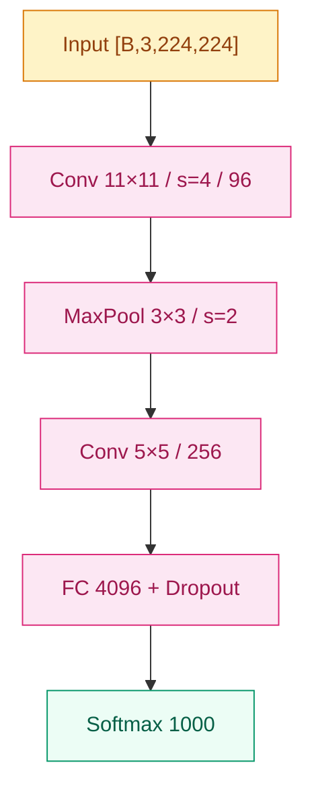
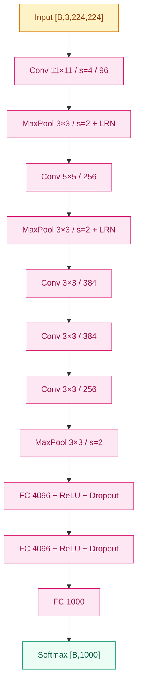

# 节点深度提升 + 图规范 Implementation Plan

> **For agentic workers:** REQUIRED SUB-SKILL: Use superpowers:subagent-driven-development (recommended) or superpowers:executing-plans to implement this plan task-by-task. Steps use checkbox (`- [ ]`) syntax for tracking.

**Goal:** 把 spec `2026-06-07-node-depth-and-figures-design.md` 落地：在风格指南中加入 `## 训练细节` 可选块、图配额、Mermaid/SVG 规范，并把 AlexNet 金标本重写到新标准（含 Mermaid 架构图 + 训练细节章节 + LRN/双 GPU/感受野等技术细节，2000–3500 字）。

**Architecture:** 三步——先升级 3 份规范文档（writing-style.md / tech-conventions.md / node template），然后把 AlexNet 按新规范重写。每份规范的改动是局部 patch（不重写整文档），AlexNet 是完全重写。最后跑 TIMELINE 生成 + 测试 + 风格条款 grep 验证。

**Tech Stack:** Markdown · Mermaid · Python 3 · git

**Spec reference:** `docs/superpowers/specs/2026-06-07-node-depth-and-figures-design.md`

---

## File Structure

修改：

- `docs/writing-style.md` — §1.1 加 `## 训练细节`；§1.2 判断表更新；§1.5 长度目标上调；新增 §1.6 图的规范
- `docs/tech-conventions.md` — §1 加 Mermaid 标签约束条款；§4 加 §4.5 图资产命名
- `docs/templates/node.md` — 加 `## 训练细节` 可选块的 HTML 注释
- `01-cnn/02-alexnet.md` — 完全重写
- `TIMELINE.md` — 脚本重生成（key_idea 不变，只是确保 frontmatter 解析仍正常）

---

### Task 1: 升级 `docs/writing-style.md` §1

**Files:**
- Modify: `docs/writing-style.md`

四处局部修改。每一处单独 Edit，避免相互干扰。

- [ ] **Step 1: §1.1 章节结构表加 `## 训练细节`**

找到 §1.1 里的 fenced 章节框（包含 `## 之前卡在哪` `## 核心思想` `## 工程陷阱` `## 关键代码` `## 影响 / 后续`），把整个 fenced block 替换为：

```
[frontmatter（7 字段，详 tech-conventions.md §3）]

# {{ name }} ({{ year }})        ← H1 中性标题，默认这样

## 之前卡在哪                    [必填] · 60-200 字
## 核心思想                      [必填]
    ### 直觉                     [可选 ###]
    ### 机制                     [可选 ###]
## 工程陷阱                      [可选 ##]
## 训练细节                      [可选 ##]
## 关键代码                      [必填] · 一个 fenced PyTorch 块
## 影响 / 后续                    [必填] · 必须以 "→ 链接" 结尾
```

(即在 `## 工程陷阱` 之后、`## 关键代码` 之前插入 `## 训练细节                      [可选 ##]` 一行。)

- [ ] **Step 2: §1.2 何时展开可选块（替换整张判断表）**

找到 §1.2 的判断表，把它替换为：

```markdown
| 工作类型 | `### 直觉/机制` | `## 工程陷阱` | `## 训练细节` |
|---|---|---|---|
| 1 概念引入型（LeNet · GRU） | 不拆 | 否 | 否 |
| 标准节点（AlexNet · VGG · DenseNet） | 看情况 | 看情况 | **加**（如果有标志性超参可考） |
| 大事件节点（ResNet · Transformer · GPT-3） | 拆 | 看情况 | **加** |
| 概念/理论型（如 LayerNorm 作为节点） | 看情况 | 看情况 | 否（无标志性超参） |
| 历史已模糊的早期工作 | 不拆 | 否 | 否 |

判断不准时优先**少拆**——读者不喜欢面对一堆三级标题。
```

`## 训练细节` 章节专门装：

- 关键超参（lr / momentum / weight decay / dropout / batch size / 优化器）
- 数据增强（裁剪、翻转、颜色扰动、Mixup/CutMix 等）
- 测试时增强（TTA）
- 训练资源 / 时长（如 "5 天 × 2 GTX 580"）
- 关键基准数据点（如 ImageNet Top-5 错误率年表、消融实验代表性结果）

(替换前先 grep 确认表格唯一定位：`grep -n "判断不准时优先" docs/writing-style.md`)

- [ ] **Step 3: §1.5 长度目标上调**

找到 §1.5 的 5 行长度目标 bullet，把它整块替换为：

```markdown
- 1 概念引入型节点：**800–1500 字**（LeNet · GRU）
- 标准节点：**2000–3500 字**（AlexNet · VGG · DenseNet）
- 大事件节点：**3000–5000 字**（ResNet · Transformer · GPT-3）
- 超过 5000 字 → 升级为 `NN-name/README.md` + 配套资源子目录

字数指汉字 + 英文单词混合计数的"视觉量"，不必精确，但偏差 ±30% 内。
```

- [ ] **Step 4: 新增 §1.6 图的规范（整节插入）**

在 `## 2. 家族 README 写作规范` 之前、`## 1. 节点 .md 写作规范` 范围内插入新的 §1.6。

定位：找到 `### 1.5 长度目标` 这一节的结尾（即下一个 `---` 或下一个 `## 2.` 标题之前），在长度目标段之后、`---` 分隔符之前插入下面整段：

`````markdown
### 1.6 图的规范

#### 1.6.1 图的配额

```
节点必填图配额（按节点类型分级，与 §1.5 长度分级一一对应）：
  · 1 概念引入型: ≥ 1 张 Mermaid（架构图，含 shape 标注）
  · 标准节点:     ≥ 1 张 Mermaid（架构图，含 shape 标注）
  · 大事件节点:   ≥ 2 张图，至少 1 张 SVG（用于核心创新可视化，如残差/注意力/特征图）

家族 README 必填图配额：
  · 1 张 Mermaid（家族级演进图，按时间排出该家族所有节点）

foundations 必填图配额：
  · 0 张（图可选；公式才是主菜）
```

#### 1.6.2 图的格式选择

- **Mermaid**（默认）—— 文本可 diff，GitHub 原生渲染。处理架构流图、流程图、家族演进图。
- **SVG**（特技）—— 处理 Mermaid 搞不定的：残差弧、注意力热图、特征图可视化、感受野累积示意。手写为主，视觉语言对齐 `web/src/components/tracks/CnnTrack.tsx`。
- **不引入** matplotlib/PNG。曲线/分布等数据可视化交给 Web 端，节点 markdown 不承担。

#### 1.6.3 图标号与标题

每张图（Mermaid 或 SVG）下方紧跟一行 caption：

````markdown
```mermaid
... 图本体 ...
```
*图 1：AlexNet 5 conv + 3 fc 主干，含每层 shape 标注。*


*图 2：残差块结构。`F(x) + x` 让深层网络可训练。*
````

- `*图 N：...*` 斜体一行，紧跟图本体
- 编号在单个节点 / 单个家族 README 内连续：图 1、图 2、图 3
- 标题 ≤ 30 字，说"看什么"而不是"怎么画"
- 跨节点不复用编号

#### 1.6.4 SVG 引用语法

```markdown
<!-- 节点内引用同家族 assets -->


<!-- 家族 README 引用同家族 assets -->

```

SVG 文件命名详见 `tech-conventions.md §4.5`。

#### 1.6.5 Mermaid 架构图模板

每个节点架构图都该照这个模板调：



约束（subagent 写作时必须遵守）：

- 每个**计算节点**标签必须含 **操作 + 关键超参**（如 `Conv 11×11 / s=4 / 96`、`FC 4096`）
- **首末节点**（input/output）标签必须含 **tensor shape**（`[B, C, H, W]` 或 `[B, T, D]`）
- `classDef` 颜色遵守 `tech-conventions.md §1` 配色
- 默认 `graph TD`，连线灰 `#d6d3d1`

`````

注意外层 5-backtick 是 plan 的引用包装，在写入实际文件时**保留**：

- 整段 §1.6 在 writing-style.md 中是普通 markdown 内容（H3 标题 + 段落 + 子标题 + code blocks）
- §1.6.3 里的 caption 例子有"markdown 里嵌 mermaid 嵌 caption"嵌套，正确做法：caption 例子整体用 4-backtick 外层包裹，内部 mermaid 块用 3-backtick

- [ ] **Step 5: 提交**

```bash
cd /Users/lauzanhing/Desktop/Daily-LLM
git add docs/writing-style.md
git commit -m "docs(style): add §1.6 figure spec; add 训练细节 optional block; raise length targets"
```

---

### Task 2: 升级 `docs/tech-conventions.md`

**Files:**
- Modify: `docs/tech-conventions.md`

两处局部修改。

- [ ] **Step 1: §1 Mermaid 配色末尾增加节点标签约束**

定位 §1 中的"约定"列表（包含"架构图默认 `graph TD`、连线灰 `#d6d3d1`、节点上标注 tensor shape"等条目）之后、§1 示例代码块（`graph TD x["Input..."]`）之前的位置。在那个位置插入下面整段（保留前后已有内容）：

```markdown
**Mermaid 节点标签约束（节点架构图）：**

- 计算节点：必含操作名 + 关键超参，例 `Conv 11×11 / s=4 / 96`
- 首末节点（input/output）：必含 tensor shape，例 `Input [B,3,224,224]`
- 详见 `writing-style.md §1.6` 的架构图模板
```

(具体定位：先 `grep -n "示例片段" docs/tech-conventions.md`，在那一行之前插入。)

- [ ] **Step 2: §4 文件命名增加 §4.5 图资产命名**

在 §4 末尾（即 §4 已有 4 条 bullet 之后、§5 之前）插入：

```markdown

### 4.5 图资产文件命名

- 节点专属 SVG：`<family>/assets/<NN>-<node-name>-<purpose>.svg`
  - 例：`01-cnn/assets/02-alexnet-arch.svg`、`01-cnn/assets/05-resnet-residual.svg`
- 家族级 SVG：`<family>/assets/<purpose>.svg`（不带节点前缀）
  - 例：`01-cnn/assets/family-evolution.svg`
- 单个家族 assets 目录承担本家族所有图，按节点编号前缀排序
- 全部 ASCII 小写 + 连字符
```

(具体定位：先 `grep -n "^## 5\." docs/tech-conventions.md`，在那一行之前插入。注意原 §4 是没有子标题的纯 bullet 列表，新加的 §4.5 用 `### 4.5` 三级标题区分。)

- [ ] **Step 3: 提交**

```bash
git add docs/tech-conventions.md
git commit -m "docs(style): add Mermaid label constraints and §4.5 image asset naming"
```

---

### Task 3: 升级 `docs/templates/node.md`

**Files:**
- Modify: `docs/templates/node.md`

- [ ] **Step 1: 在工程陷阱注释之后插入训练细节注释**

定位现有的 `## 工程陷阱` HTML 注释块（即 `<!--\n## 工程陷阱\n（可选二级标题。...）\n-->`），在它之后、`## 关键代码` 之前插入：

```markdown

<!--
## 训练细节
（可选二级标题。装关键超参、数据增强、训练资源/时长、基准数据点。
适用于有具体超参可考的历史里程碑或现代工作。例如 AlexNet / ResNet / GPT-3。）
-->
```

- [ ] **Step 2: 验证模板结构**

```bash
grep -nE "^## |^<!--$" docs/templates/node.md
```

预期看到顺序：之前卡在哪 → 核心思想 → 工程陷阱（注释）→ 训练细节（注释，新增）→ 关键代码 → 影响 / 后续。

- [ ] **Step 3: 提交**

```bash
git add docs/templates/node.md
git commit -m "docs(style): add 训练细节 optional block hint to node template"
```

---

### Task 4: 重写 `01-cnn/02-alexnet.md` 为新金标本

**Files:**
- Modify: `01-cnn/02-alexnet.md`（完全重写）

这是本 plan 的**集成验收任务**。

`01-cnn/02-alexnet.md` 当前是 101 行的 1250 字符版本；新版本应到 2000–3500 字（±30% = 1400–4550 字），包含：

- 4 必填章节
- **新展开 `## 训练细节`**（标准节点 + 有标志性超参的典型场景）
- **不展开** `### 直觉` / `### 机制` 和 `## 工程陷阱`（保留"小节点示范"语义）
- 新增内容：LRN、双 GPU 切分、感受野计算、超参、数据增强细节、训练资源、TTA、ImageNet 年表
- 1 张 Mermaid 架构图（图 1）+ caption

#### 完整目标内容

完全覆盖现有文件。下面用 5-backtick 外层包装（实际写入文件时**去掉 5-backtick 外层**，内部的 3-backtick 块保留）：

`````markdown
---
name: "AlexNet"
year: 2012
family: "01-cnn"
order: 2
paper: "ImageNet Classification with Deep Convolutional Neural Networks"
authors: ["Alex Krizhevsky", "Ilya Sutskever", "Geoffrey Hinton"]
key_idea: "把深 CNN + ReLU + Dropout + 双 GPU 训练打包一起拿出来，第一次把 ImageNet Top-5 错误率从 26% 砸到 15.3%"
---

# AlexNet (2012)

## 之前卡在哪

2012 年之前，图像识别的主流是 SIFT、HOG 这类**人手设计的局部特征** + SVM 这种线性/核分类器。ImageNet 这种规模的视觉竞赛，多年来 Top-5 错误率卡在 25–26% 之间寸步难行——每年的进展更多靠特征工程的拼凑，而不是真正的能力跃迁。

神经网络这条路，社区其实没忘——[反向传播](../foundations/01-neural-network-basics/)早在 80 年代就被提出过，LeNet-5 也跑通过手写数字。但深一点的网络一上来就遇到三个看上去无解的麻烦：

- **算力**：训练几百万张 224×224 的图像，CPU 算力差几个数量级
- **过拟合**：参数量到千万级，没有正则手段，几乎必然过拟合
- **梯度**：Sigmoid/Tanh 这类饱和激活让深层梯度迅速衰减

主流观点是：神经网络这条路在视觉上"很可能永远比不过手工特征"。AlexNet 出现之前的几年，几乎没有 vision 大会论文严肃地把 CNN 当 baseline。

## 核心思想

AlexNet 不是某一个新想法的胜利，而是**一组耦合招式**第一次被同时拿出来：8 层卷积/全连接（5 conv + 3 fc）+ [ReLU 激活](../foundations/02-activations/) + [Dropout](../foundations/07-regularization/) + 数据增强 + 双 GPU 并行训练 + 比赛级 CUDA 实现。这一组里少一样，可能都跑不出来。


*图 1：AlexNet 主干（5 conv + 3 fc），shape 与 LRN 位置标注。*

**卷积层** 在二维平面共享一组小滤波器，对像素的二维邻域关系敏感：

$$
y_{i,j,k} = \sum_{c,u,v} w_{c,u,v,k} \cdot x_{i+u,\, j+v,\, c} + b_k
$$

参数数量与图像尺寸**解耦**（只取决于卷积核与通道），相比把图像压平喂全连接，参数量降几个数量级，同时把"邻居像素更可能相关"这件事写进了结构里。

**最后一层 Softmax + 交叉熵** 把 1000 维 logits 转成概率分布并最大化对正确类的对数似然：

$$
p_k = \frac{e^{z_k}}{\sum_{j} e^{z_j}}, \quad \mathcal{L} = -\log p_{y}
$$

> 你要记住：AlexNet 真正改写游戏的不是"更深一点的 CNN"，而是**第一次证明端到端学到的特征在视觉上能稳定碾压所有手工特征**。从这一刻起，"先设计特征再分类"这条 30 年的主路死了。

### ReLU 取代 Sigmoid

原本梯度在深层迅速衰减，训练几乎不收敛；换成 `max(0, x)` 后梯度在正区间恒等于 1，深网才真的能"训得动"。这条经验后来变成了所有现代视觉模型的默认配置（[激活函数演化](../foundations/02-activations/)）。

### LRN（Local Response Normalization）

原始论文用 LRN 在 ReLU 之后做一种"侧向抑制"：相邻通道相互压制，让响应大的位置更突出。形式上：

$$
b_{x,y,k} = a_{x,y,k} \left/ \left( c_0 + \alpha \sum_{j=\max(0,k-n/2)}^{\min(K-1,k+n/2)} a_{x,y,j}^2 \right)^{\beta} \right.
$$

参数取 $c_0=2, n=5, \alpha=10^{-4}, \beta=0.75$。**这一层在后续工作里被快速抛弃**——2014 年 VGG 与 2015 年 Inception 都证明 LRN 对最终精度几乎无贡献，BatchNorm 出现后更是彻底取代了它。今天读 AlexNet 代码看到 LRN，知道是历史遗物即可，不要照抄。

### 双 GPU 切分（Group Conv 的祖宗）

AlexNet 论文里通道维被切成两半，分别放在两块 GTX 580（每块 3 GB 显存）上跑。只有部分层（如 conv3、fc 层）跨 GPU 通信，其它层各自独立。这种切分**纯粹是显存约束下的工程妥协**，但它在 2017 年的 [ResNeXt](../foundations/) 和 MobileNet 里以"分组卷积（group convolution）"的名义重生，成了高效模型的标配。今天用单卡跑 AlexNet，把通道合并即可，不必复现切分。

### 感受野的累积

5 个卷积层叠下来，最后一个 conv 输出位置看到的输入感受野显著扩大。粗略估算（不算 padding 边界效应）：

| 层 | kernel / stride | 该层感受野 | 累积感受野（相对 input） |
|---|---|---|---|
| conv1 | 11/4 | 11 | 11 |
| pool1 | 3/2 | — | 19 |
| conv2 | 5/1 | — | 51 |
| pool2 | 3/2 | — | 67 |
| conv3 | 3/1 | — | 99 |
| conv4 | 3/1 | — | 131 |
| conv5 | 3/1 | — | 163 |
| pool5 | 3/2 | — | 195 |

最后一层每个空间位置看到的"上下文"约 195×195，已经覆盖 224 输入的大部分。

## 训练细节

| 维度 | 值 |
|---|---|
| 优化器 | SGD + Momentum |
| 学习率 | 0.01，验证 loss 停滞时手动除以 10，共降 3 次 |
| 动量 | 0.9 |
| 权重衰减 | 5×10⁻⁴ |
| Dropout | p=0.5，仅 fc6 / fc7 |
| Batch size | 128 |
| Epochs | ~90 |
| 权重初始化 | N(0, 0.01²)，bias 用常数（卷积层 0，部分 fc 用 1） |

**数据增强**（在 256×256 训练图上做）：

- **随机裁剪**：从 256 中随机抠 224×224，加 5 倍数据
- **左右翻转**：再加 1 倍
- **PCA 颜色扰动**：对 ImageNet 训练集像素做 PCA，按主成分加随机扰动模拟光照变化

**测试时增强**：取中心 + 四角共 5 个 224×224 patch + 各自水平翻转，共 10 个 crop 输入网络，平均 softmax 概率。

**训练资源**：两块 GTX 580（3 GB 显存）跨卡训练，~5 天。

**ImageNet 错误率年表（Top-5）：**

| 年份 | 方法 | Top-5 错误率 |
|---|---|---|
| 2010 | NEC-UIUC（手工特征 + SVM） | 28.2% |
| 2011 | XRCE（手工特征 + Fisher Vector） | 25.8% |
| 2012 | **AlexNet 单模型** | **18.2%** |
| 2012 | **AlexNet 5-model ensemble** | **16.4%** |
| 2012 | **AlexNet 7-model + 预训练** | **15.3%** |

15.3% 这个最终上榜数字比第二名领先约 10 个百分点——这个差距让"CNN 是否真的能赢"的争论一夜终结。

## 关键代码

下面这段框出 AlexNet 的主干结构（5 conv + 3 fc + ReLU + Dropout），shape 注释标在每层旁边。LRN 与双 GPU 切分按现代实践省略：

```python
import torch
import torch.nn as nn

class AlexNet(nn.Module):
    def __init__(self, num_classes: int = 1000):
        super().__init__()
        # 5 个卷积块：渐缩空间 / 渐增通道 / 关键节点 MaxPool
        self.features = nn.Sequential(
            nn.Conv2d(3, 96, kernel_size=11, stride=4, padding=2),   # [B,96,55,55]
            nn.ReLU(inplace=True),
            nn.MaxPool2d(kernel_size=3, stride=2),                   # [B,96,27,27]
            nn.Conv2d(96, 256, kernel_size=5, padding=2),            # [B,256,27,27]
            nn.ReLU(inplace=True),
            nn.MaxPool2d(kernel_size=3, stride=2),                   # [B,256,13,13]
            nn.Conv2d(256, 384, kernel_size=3, padding=1),
            nn.ReLU(inplace=True),
            nn.Conv2d(384, 384, kernel_size=3, padding=1),
            nn.ReLU(inplace=True),
            nn.Conv2d(384, 256, kernel_size=3, padding=1),
            nn.ReLU(inplace=True),
            nn.MaxPool2d(kernel_size=3, stride=2),                   # [B,256,6,6]
        )
        # 3 个全连接：两层 4096 + Dropout，最后 1000 类
        self.classifier = nn.Sequential(
            nn.Dropout(p=0.5),
            nn.Linear(256 * 6 * 6, 4096), nn.ReLU(inplace=True),
            nn.Dropout(p=0.5),
            nn.Linear(4096, 4096), nn.ReLU(inplace=True),
            nn.Linear(4096, num_classes),
        )

    def forward(self, x: torch.Tensor) -> torch.Tensor:
        x = self.features(x)
        x = torch.flatten(x, 1)
        return self.classifier(x)
```

## 影响 / 后续

AlexNet 的成绩——Top-5 错误率 **15.3%**，比第二名（26.2%）领先 10 个百分点以上——直接让 ImageNet 2012 成了视觉社区的转折点。从这一刻起，CNN 不再是"一种 baseline"，而是**唯一 baseline**；手工特征工程作为一个研究方向迅速萎缩。

但 AlexNet 自己留下的局限同样明显。它的"深"只到 8 层，再往上叠会出现退化——训练误差先降后升，看上去像优化问题而不是过拟合。**这个洞要等到 ResNet 才被真正填上**。同时它的 11×11 大卷积、复杂双 GPU 切分、五种学习率调度、LRN 这些工程上的"原始痕迹"，在后续几年里被逐个抛弃。

→ [03-vgg.md](03-vgg.md) · 把"深 CNN"标准化成纯 3×3 堆叠，证明深度本身的价值
→ [05-resnet.md](05-resnet.md) · 用残差连接终结"再深就退化"的问题
→ [../foundations/04-normalization/](../foundations/04-normalization/) · BatchNorm 出现后训练稳定性才真正被解决（AlexNet 用的 LRN 已淘汰）
→ [../foundations/02-activations/](../foundations/02-activations/) · ReLU 取代饱和激活，是后续所有视觉模型的默认起点
`````

注意：上述内容用 5-backtick 外层包装，subagent 写入文件时**只写中间的 markdown 内容**（不包含 5-backtick 外层），内部的 3-backtick mermaid 块和 python 块原样保留。

#### 实施步骤

- [ ] **Step 1: 整体替换 `01-cnn/02-alexnet.md`**

写入上述完整内容到 `01-cnn/02-alexnet.md`（覆盖现有内容）。

- [ ] **Step 2: 长度自检**

```bash
python3 -c "import re; t=open('01-cnn/02-alexnet.md').read(); zh=len(re.findall(r'[一-鿿]',t)); en=len(re.findall(r'[A-Za-z]+',t)); print(f'zh={zh}, en_tokens={en}, est_total={zh+en}')"
```

预期：est_total 在 2000–3500（±30% 容差 1400–4550）。如果显著偏离，BLOCKED 报告。

- [ ] **Step 3: 风格条款 grep 校验**

```bash
echo "=== 1. H1 中性 ===" && head -12 01-cnn/02-alexnet.md | grep -n "^# AlexNet (2012)"
echo "=== 2. frontmatter 7 字段 ===" && head -10 01-cnn/02-alexnet.md | grep -cE "^(name|year|family|order|paper|authors|key_idea):"
echo "=== 3. 「你要记住」1 次 ===" && grep -c "^> 你要记住" 01-cnn/02-alexnet.md
echo "=== 4. 影响后续 ≥ 2 个 → 链接 ===" && awk '/^## 影响/{flag=1;next}/^## /{flag=0}flag' 01-cnn/02-alexnet.md | grep -c "^→"
echo "=== 5. foundations 引用 ≥ 1 ===" && grep -cE "foundations/(01-neural|02-activations|07-regularization|04-normalization)" 01-cnn/02-alexnet.md
echo "=== 6. 含 ## 训练细节 ===" && grep -nE "^## 训练细节" 01-cnn/02-alexnet.md
echo "=== 7. 含 Mermaid 架构图 ===" && grep -nE "^\`\`\`mermaid" 01-cnn/02-alexnet.md
echo "=== 8. 含图 1 caption ===" && grep -nE "^\*图 1：" 01-cnn/02-alexnet.md
echo "=== 9. 含 LRN 内容 ===" && grep -nE "LRN|Local Response" 01-cnn/02-alexnet.md
echo "=== 10. 含双 GPU 切分 ===" && grep -nE "GTX 580|双 GPU|两块" 01-cnn/02-alexnet.md
echo "=== 11. 含 ImageNet 年表 ===" && grep -nE "2010.*28\.2%|2011.*25\.8%|NEC-UIUC|XRCE" 01-cnn/02-alexnet.md
echo "=== 12. 不展开 ### 直觉/机制 ===" && (grep -nE "^### (直觉|机制)" 01-cnn/02-alexnet.md && echo FAIL) || echo OK
echo "=== 13. 不展开 ## 工程陷阱 ===" && (grep -n "^## 工程陷阱" 01-cnn/02-alexnet.md && echo FAIL) || echo OK
```

每项预期：

1. 命中
2. 计数 = 7
3. 计数 = 1
4. 计数 ≥ 2
5. 计数 ≥ 1
6. 命中 1 行
7. 命中 1 行（架构图 mermaid 起始）
8. 命中 1 行
9. 至少 1 处命中
10. 至少 1 处命中
11. 至少 1 处命中
12. 输出 OK
13. 输出 OK

任何项 FAIL 必须先修内容再继续。

- [ ] **Step 4: 重生成 TIMELINE.md**

```bash
python3 scripts/generate_timeline.py
```

预期：`wrote /Users/lauzanhing/Desktop/Daily-LLM/TIMELINE.md (1 nodes)`

- [ ] **Step 5: 校验 TIMELINE.md AlexNet 行**

```bash
grep "AlexNet" TIMELINE.md
```

预期：包含 `2012`、`AlexNet`、`01-cnn`、key_idea 完整字符串。

- [ ] **Step 6: 提交**

```bash
git add 01-cnn/02-alexnet.md TIMELINE.md
git commit -m "feat(01-cnn): expand AlexNet golden sample with Mermaid arch, 训练细节, LRN/dual-GPU/RF details"
```

---

### Task 5: 端到端冒烟（spec §7 验收）

**Files:** 无新增

- [ ] **Step 1: 三份指南内容齐全**

```bash
grep -nE "^### 1\.6" docs/writing-style.md && echo OK || echo FAIL
grep -nE "^### 4\.5" docs/tech-conventions.md && echo OK || echo FAIL
grep -nE "训练细节" docs/templates/node.md && echo OK || echo FAIL
```

每条预期：命中 + `OK`

- [ ] **Step 2: AlexNet 完整性（重跑 Task 4 Step 3 的 13 条 grep）**

把 Task 4 Step 3 的 13 条 grep 整段重新跑一遍，确认全部通过。

- [ ] **Step 3: 脚本测试仍正常**

```bash
python3 -m pytest scripts/test_generate_timeline.py -v 2>&1 | tail -3
```

预期：`2 passed`

- [ ] **Step 4: 工作树干净**

```bash
git status -s
```

预期：除 `.claude/` 等本地未追踪外，无未提交改动。

---

## 完成判定（对齐 spec §7）

| # | 验收标准 | 落实任务 |
|---|------|--------|
| 1 | writing-style.md §1 更新完整（章节集合 / 判断表 / 长度 / §1.6 图规范） | Task 1 |
| 2 | tech-conventions.md §1 + §4.5 更新 | Task 2 |
| 3 | templates/node.md 加新可选块注释 | Task 3 |
| 4 | AlexNet 重写后包含训练细节 / LRN / 双 GPU / 感受野 / Mermaid 架构图 + caption / 长度达标 / 不展开 ### 直觉/机制 / ## 工程陷阱 | Task 4 |
| 5 | TIMELINE.md 重新生成正常 | Task 4 |
| 6 | 脚本测试仍 2/2 PASS | Task 5 |

---

## 后续 plan 概览（不在本计划范围内）

- 其他家族 / 节点的内容（仍由后续每家族 content plan 完成；新 AlexNet 是参照锚）
- Web 端 mini-arch SVG 抽取（未来工作）
- foundations 模块的图规范细化（本期保持 0 张配额）
