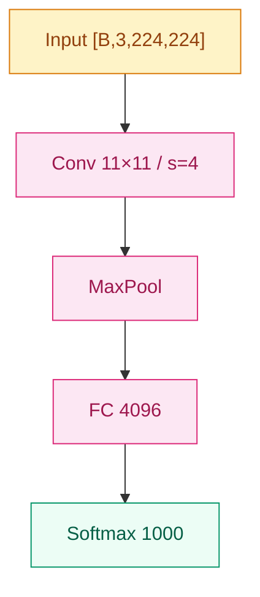

# 统一写作风格指南 Implementation Plan

> **For agentic workers:** REQUIRED SUB-SKILL: Use superpowers:subagent-driven-development (recommended) or superpowers:executing-plans to implement this plan task-by-task. Steps use checkbox (`- [ ]`) syntax for tracking.

**Goal:** 把 spec `2026-06-07-writing-style-guide-design.md` 落地为三份风格指南文件 + 一个 AlexNet 金标本节点，作为后续 15 个家族 content plan 的统一锚。

**Architecture:** 拆三份职责清楚的文档（`AGENTS.md` 项目元信息 / `docs/writing-style.md` 写作规范 / `docs/tech-conventions.md` 技术约定），同步微调已有模板与跳板（`docs/templates/{family-readme,node}.md`、`STYLE.md`），最后用一份完整的 `01-cnn/02-alexnet.md` 重写作为"指南是否落地"的集成验收。

**Tech Stack:** Markdown · Mermaid · YAML frontmatter · Python 3（验证现有生成脚本仍正常）· git

**Spec reference:** `docs/superpowers/specs/2026-06-07-writing-style-guide-design.md`

---

## File Structure

新建：

- `docs/writing-style.md` — 主战场：三层模板 + 调性 + 跨引用规范
- `docs/tech-conventions.md` — 技术约定：Mermaid + 代码 + frontmatter + 命名

重写：

- `AGENTS.md` — 瘦身到 < 40 行，三个职责跳板
- `STYLE.md` — 跳板改指向 `docs/writing-style.md`
- `01-cnn/02-alexnet.md` — 完整 1500–2500 字示范节点（金标本）

微调：

- `docs/templates/family-readme.md` — 对齐 §4.2 章节细则与长度目标注释
- `docs/templates/node.md` — 对齐 §4.1 章节细则、frontmatter 加 `authors`

验证：

- `TIMELINE.md` — 重新生成，确认 AlexNet 重写后 frontmatter 解析正常

---

### Task 1: `docs/tech-conventions.md` — 技术约定

**Files:**
- Create: `docs/tech-conventions.md`

写技术约定先于写作规范，因为后者会引用前者（frontmatter 字段名、Mermaid 颜色等）。

- [ ] **Step 1: 创建文件**

写入 `docs/tech-conventions.md`：

````markdown
# Daily-LLM · 技术约定

> Mermaid 配色、代码规范、frontmatter 契约、文件命名。
> 写内容的风格 → `writing-style.md`。
> 项目元信息 → `../AGENTS.md`。

## 1. Mermaid 配色（全仓库统一）

所有 Mermaid 图必须沿用以下五类语义色：

| 语义 | fill | stroke | color |
|------|------|--------|-------|
| 输入 / 数据 | `#fef3c7` | `#d97706` | `#92400e` |
| 计算 / 变换 | `#fce7f3` | `#db2777` | `#9d174d` |
| 输出 / 结果 | `#ecfdf5` | `#059669` | `#065f46` |
| 问题 / 局限 | `#fff7ed` | `#ea580c` | `#9a3412` |
| 演进 / 链接 | `#eff6ff` | `#2563eb` | `#1e40af` |

约定：

- 架构图默认 `graph TD`
- 连线灰 `#d6d3d1`
- 节点上标注 tensor shape，如 `[B, C, H, W]`
- 跨家族对比图允许用"演进 / 链接"色把不同家族标出

示例片段：



## 2. Python / PyTorch 代码规范

### 2.1 文件头与注释

- 文件头 docstring：`"""模块名 · 路径 · 核心 1-2 句 · 关键依赖"""`
- 函数三行注释头，无前缀标签，直接写内容：

```python
# 按相关性做加权聚合
# softmax(QK^T / √d_k) @ V
# 时间 O(n²d)，空间 O(n²)
def scaled_dot_product_attention(q, k, v, mask=None):
    ...
```

### 2.2 Shape 标注

Docstring 的 Args 必须标注 shape：

```python
"""
Args:
    q: (batch, heads, seq, d_k)
    k: (batch, heads, seq, d_k)
    v: (batch, heads, seq, d_v)
    mask: (batch, 1, seq, seq) 或 None
Returns:
    out: (batch, heads, seq, d_v)
"""
```

### 2.3 其它

- 魔法数字命名为常量，不要散落在表达式里
- 随机种子统一 `torch.manual_seed(42)`
- 格式化：Black，行宽 88
- 不使用 `from xxx import *`

### 2.4 节点 `## 关键代码` 块的额外要求

- 必须**单文件可跑**——不依赖未定义的 import；如需 PyTorch，`import torch` 显式写出
- 核心机制 ≤ 30 行能讲清就别堆样板（数据加载、训练循环之类省掉）
- fenced 块上一行用 1 行注释说"这段在演示什么"，例如：

`````markdown
下面这段演示残差块的最小骨架，关键是 `out = F(x) + x` 这一行：

````python
import torch
import torch.nn as nn

class ResidualBlock(nn.Module):
    def __init__(self, c):
        super().__init__()
        self.f = nn.Sequential(
            nn.Conv2d(c, c, 3, padding=1),
            nn.BatchNorm2d(c),
            nn.ReLU(inplace=True),
            nn.Conv2d(c, c, 3, padding=1),
            nn.BatchNorm2d(c),
        )

    def forward(self, x):
        return torch.relu(self.f(x) + x)
````
`````

写入文件时**保留**上面这段示例的 5/4-backtick 嵌套结构（外层 5 反引号显示一段 markdown 示例，内部 4 反引号显示一段 Python）。这是 markdown 文档里"如何展示代码块示例"的标准做法。

## 3. frontmatter 契约（节点专属）

每个节点 markdown 文件顶部必须有 7 字段 frontmatter：

```yaml
---
name: "工作名（英文或惯用名）"
year: 2015
family: "01-cnn"
order: 5
paper: "完整论文标题"
authors: ["He Kaiming", "Zhang Xiangyu"]
key_idea: "≤ 80 字的一句话核心"
---
```

规则：

- **7 字段全部出现**（值可为空字符串/空数组，但字段必须在）
- `key_idea` ≤ 80 字（这句会显示在自动生成的 `TIMELINE.md` 表格里）
- `order` 与文件名前缀一致：`05-resnet.md` → `order: 5`
- `family` 与所在家族目录一致：`01-cnn/05-resnet.md` → `family: "01-cnn"`
- `year` 用首次发表年（arXiv 首版优先，会议版年份次之）
- `authors` 是数组，可空 `[]`；姓名用论文署名顺序

**家族 README / foundations 模块不写 frontmatter**——它们不参与 `TIMELINE.md` 生成，生成脚本 `scripts/generate_timeline.py` 仅扫描根目录下匹配 `^\d{2}-[a-z0-9\-]+$` 的家族目录。

## 4. 文件命名

- 家族目录：`NN-kebab-case`，如 `01-cnn`、`06-bert-family`
- 节点文件：`NN-kebab-case.md`，编号与 frontmatter `order` 一致
- 节点目录形态（升级版）：`NN-kebab-case/README.md` + 配套资源
- foundations 子目录：`NN-kebab-case`，如 `02-activations`、`08-attention-mechanism`
- 全部 ASCII 小写 + 连字符；不要下划线，不要中文文件名，不要驼峰

## 5. 跨家族 / foundations 引用语法

详见 `writing-style.md` §1.4。本文档不重复，避免双正本。
````

- [ ] **Step 2: 提交**

```bash
git add docs/tech-conventions.md
git commit -m "docs(style): add tech-conventions.md (Mermaid · code · frontmatter · naming)"
```

---

### Task 2: `docs/writing-style.md` — 主写作规范

**Files:**
- Create: `docs/writing-style.md`

- [ ] **Step 1: 创建文件**

写入 `docs/writing-style.md`：

````markdown
# Daily-LLM · 写作风格指南

> 三层模板（节点 / 家族 README / foundations）、调性、跨引用规范。
> 技术约定（Mermaid / 代码 / frontmatter）→ `tech-conventions.md`。
> 项目元信息 → `../AGENTS.md`。
>
> 写节点前先读一遍 [01-cnn/02-alexnet.md](../01-cnn/02-alexnet.md)——那是金标本。

---

## 0. 设计哲学

仓库的辨识度来自一种叙事框架："**每一个工作都是被前一代的局限逼出来的**。"
所有节点 / 家族 / foundations 的写作都服务于这条线。规则只是为了让这条线在 90+ 个节点里不走样。

三层规范对照：

| 项目 | 家族 README | 节点 .md | foundations 模块 |
|------|------------|---------|-----------------|
| 主轴 | 时间线 | 单个工作 | 概念簇 |
| "之前卡在哪" | 不写 | 必填 | 不写（替换为"为什么必须存在"） |
| "你要记住" | 不写 | 可选 0–2 次 | 不写 |
| "工程陷阱" | 不写 | 可选 | 不写（去家族节点里讲） |
| 公式 | 1–2 个 | 看复杂度 | 必填，是主菜 |
| 代码 | 不写 | 必填 | 可选 |
| Mermaid | 家族级演进图 | 工作内部结构 | 概念示意（如有） |
| 长度 | 600–1200 字 | 800–4000 字 | 800–1800 字 |

---

## 1. 节点 `.md` 写作规范

### 1.1 章节结构（锁死）

```
[frontmatter（7 字段，详 tech-conventions.md §3）]

# {{ name }} ({{ year }})        ← H1 中性标题，默认这样

## 之前卡在哪                    [必填] · 60-200 字
## 核心思想                      [必填]
    ### 直觉                     [可选 ###]
    ### 机制                     [可选 ###]
## 工程陷阱                      [可选 ##]
## 关键代码                      [必填] · 一个 fenced PyTorch 块
## 影响 / 后续                    [必填] · 必须以 "→ 链接" 结尾
```

### 1.2 何时展开可选块

| 工作复杂度 | 处理 | 例 |
|---|---|---|
| 引入 1 个新概念 | "核心思想"单段，不拆 | LeNet · GRU |
| 引入 ≥ 2 个新概念 / 有特殊公式 | 拆 `### 直觉` + `### 机制` | ResNet · Transformer |
| 有著名训练/部署坑 | 加 `## 工程陷阱` | Inception · EfficientNet · BatchNorm |

判断不准时优先**少拆**——读者不喜欢面对一堆三级标题。

### 1.3 调性约束

**强制 3 项：**

1. **「之前卡在哪」必须用因果叙述**——禁止"X 提出了 Y"句式；要写"在 X 之前，业界因为 Z 卡住；Y 第一次让 Z 不再是障碍"。
   一句话给现象，一句话给数字（如有），一句话给情绪/共识（"普遍认为...至少还要十年"这种）。
2. **「影响 / 后续」必须显式"传球给谁"**——以箭头链接结尾：

   ```markdown
   → [03-vgg.md](03-vgg.md) · 把"深 CNN"推到下一档
   → [foundations/04-normalization/](../foundations/04-normalization/) · 训练深网络的关键工具
   ```
3. **公式先于代码**——核心机制必须用数学先呈现（行内 LaTeX 或块公式），PyTorch 在后。禁止"直接上代码不解释"。

**鼓励但不强制：**

- **「你要记住」一句话钩子**——全节点 0–2 次，用 blockquote：

   ```markdown
   > 你要记住：残差不是为了让网络更深，是为了让深网络可训练。
   ```
- 疑问句标题 `# 为什么 X 不够？—— Y`——**仅当替代关系成立时使用**。
  例如 `# 为什么 Word2Vec 不够？—— Transformer` 不成立（Word2Vec 没被 Transformer 替代）。
  默认采用 `# 工作名 (年份)` 中性标题。

### 1.4 跨家族 / foundations 引用语法

正本只在一处，其他位置全部相对链接：

```markdown
<!-- 引用前置基础 -->
本节假设你熟悉[反向传播](../foundations/01-neural-network-basics/)
和[激活函数](../foundations/02-activations/)。

<!-- 引用同家族其他节点 -->
ResNet 终结了 [VGG](03-vgg.md) 路线的内卷。

<!-- 引用其他家族 -->
这个套路后来被 [05 Transformer](../05-transformer/) 借走，成了 Add & Norm。
```

**禁止**：

- 在节点里复制粘贴 foundations 的内容
- 在节点里重新讲一遍反向传播 / 激活函数 / 归一化等横切概念

如果 foundations 讲得不够清楚，去改 foundations，**不要在节点里打补丁**。

### 1.5 长度目标

- 1 概念引入型节点：**800–1500 字**（LeNet · GRU）
- 标准节点：**1500–2500 字**（AlexNet · VGG · DenseNet）
- 大事件节点：**2500–4000 字**（ResNet · Transformer · GPT-3）
- 超过 4000 字 → 升级为 `NN-name/README.md` + 配套资源子目录

字数指汉字 + 英文单词混合计数的"视觉量"，不必精确，但偏差 ±30% 内。

---

## 2. 家族 README 写作规范

家族 README ≠ 节点放大版。**它是门面 + 导航 + 概念入门**——目标读者是"想搞清这个家族干啥"的人，不是"想深入某个具体工作"的人。

### 2.1 章节细则

```
# {{ family_name }}                              [H1 纯名字]

> {{ one_line_positioning }}                     [blockquote · 12-25 字]

## 一句话定位                  [必填 · 100-250 字]
## 概念本身                    [必填 · 300-600 字]
## 子时间线                    [必填 · 表格]
## 依赖与延伸                  [必填]
```

- **一句话定位**：1 段，这个家族解决了什么、被什么逼出来。不上公式、不上代码。
- **概念本身**：直觉解释 + 1–2 个关键公式（如有）。可选 1 张家族级 Mermaid 总览图。让没读过节点的人也能"知道这家族大概是怎么回事"。
- **子时间线**：表格列固定为 `年份 / 名字 / 关键贡献 / 之前卡在哪`，名字列必须是相对链接，指向同目录 .md 或 `NN-name/` 子目录。表格下方可选 80 字内"承上启下"小结。
- **依赖与延伸**：
  - "前置（foundations）"：3–6 条 `../foundations/NN-xxx/` 链接
  - "通向哪些家族"：1–3 条 `../NN-xxx/` 链接 + 一句话理由

### 2.2 与节点的语气差异

- README **不写**「你要记住」钩子（节点专属）
- README **不写**「之前卡在哪」大段叙述——顶多在"一句话定位"里一句话带过
- README **不写**「工程陷阱」（节点专属）
- README 里若放 Mermaid，必须是**家族级演进图**（如 `LeNet → AlexNet → VGG → ResNet → ...`），不能是某个具体工作的内部结构

### 2.3 长度

总长 **600–1200 字**。超过即说明把节点该讲的内容塞进 README 了，拆出去。

---

## 3. foundations 子模块写作规范

foundations 和家族在"形式"上像（一个上层概念下挂多个子项），但**性质完全不同**：

- 家族 = 时间线（有先后、有因果、有传承）
- foundations = 概念簇（无先后，关注"是什么 / 各种变体 / 怎么选"）

### 3.1 章节细则

```
# {{ topic_name }}                                [H1 主题名]

> 横切基础。被 [家族 NN-xxx](../NN-xxx/) 等家族引用。

## 是什么                      [必填 · 200-400 字]
## 直觉 + 公式                 [必填 · 300-500 字]
## 各种变体                    [必填 · 表格 + 可选段落]
## 怎么选                      [可选 · ≤ 300 字]
## 被谁用到                    [必填 · 列表]
## 极简代码                    [可选 · ≤ 30 行]
```

- **是什么**：定位 + 为什么必须存在（"如果没有它，整个模型会怎样？"）
- **直觉 + 公式**：最关键的几个公式，配 Mermaid/ASCII 图（如适合）。不展开特定家族应用。
- **各种变体**：表格列 `名字 / 公式（行内 LaTeX）/ 何时用 / 谁先用了`。下方按需展开 ≤ 500 字详细对比。
- **怎么选**：实用决策树或经验法则。"默认 ReLU；Transformer 用 GELU；移动端用 ReLU6"。**没强建议就略掉本节**，不要硬凑。
- **被谁用到**：列出引用本基础的家族 + 一句话场景。例：
  ```markdown
  - [01-cnn/](../01-cnn/) — 卷积层后的标配
  - [05-transformer/](../05-transformer/) — FFN 内部用 GELU
  ```
- **极简代码**：仅在 ≤ 30 行能精炼讲清概念时才放。复杂的留给家族节点。

### 3.2 长度

总长 **800–1800 字**。

### 3.3 frontmatter

foundations 模块**不写** frontmatter——不参与 `TIMELINE.md` 生成。

---

## 4. 常见错误清单（subagent 写作前必读）

| 错误 | 为什么不行 |
|---|---|
| 节点开头直接讲算法 | 缺"之前卡在哪"，读者不知道为什么要学这个 |
| 公式后直接上代码、没文字串接 | 违反 §1.3 第 3 条 |
| "影响 / 后续"段没有 `→ 链接` | 违反 §1.3 第 2 条 |
| 「你要记住」用了 ≥ 3 次 | 失去钩子的稀缺性 |
| 节点里讲反向传播/激活函数细节 | 违反单一正本原则，应该链到 foundations |
| 家族 README 写成节点的合集 | README 不是节点目录，是导航 + 概念入门 |
| README 里出现"工程陷阱" | 这是节点章节 |
| foundations 模块写"被 X 逼出来" | foundations 是横切，不讲历史 |
| 节点 frontmatter `key_idea` 超 80 字 | `TIMELINE.md` 表格会被撑变形 |
| 文件名带下划线或中文 | 违反命名约定（详 `tech-conventions.md` §4） |

---

## 5. 写作前的小自检

提交一个节点 / README / foundations 模块前，对照清单：

**节点**：

- [ ] frontmatter 7 字段齐全，`key_idea` ≤ 80 字
- [ ] H1 用 `# 工作名 (年份)`，疑问句标题仅在替代关系成立时才用
- [ ] `## 之前卡在哪` 是因果叙述，不是"X 提出了 Y"
- [ ] `## 核心思想` 公式先于代码
- [ ] `## 关键代码` 单文件可跑、≤ 30 行能讲清就不堆样板
- [ ] `## 影响 / 后续` 至少 1 个 `→ 链接`
- [ ] 「你要记住」0–2 次
- [ ] 没复制粘贴 foundations 内容
- [ ] 长度在目标区间 ±30% 内

**家族 README**：

- [ ] 4 块章节齐全
- [ ] 子时间线表格列固定为 4 列，名字列是链接
- [ ] 没写「你要记住」/「之前卡在哪」/「工程陷阱」（这些是节点专属）
- [ ] Mermaid 是家族级演进图，不是某节点内部
- [ ] 总长 600–1200 字

**foundations 模块**：

- [ ] 6 章节模板（4 必填 + 2 可选）齐全
- [ ] 没写 frontmatter
- [ ] 没讲历史/因果（"被 X 逼出来"这种是节点的事）
- [ ] 「被谁用到」列表至少有 1 条
- [ ] 总长 800–1800 字
````

（注：上面文档里出现的 ` ​```python `、` ​``` ` 等含零宽空格的标记，是为了让 prompt 的外层 fenced block 不提前结束。在你写入的实际文件里**全部用普通三反引号**，不要保留零宽空格、不要加前导空格。）

- [ ] **Step 2: 提交**

```bash
git add docs/writing-style.md
git commit -m "docs(style): add writing-style.md (3-layer templates · voice · cross-refs)"
```

---

### Task 3: `AGENTS.md` 瘦身

**Files:**
- Modify: `AGENTS.md`（完全重写）

- [ ] **Step 1: 整体替换内容**

把 `AGENTS.md` 全文替换为：

````markdown
# AGENTS.md · Daily-LLM 项目元信息

> 这里只放"我是什么项目、有什么约定"。
>
> 怎么写内容 → [docs/writing-style.md](docs/writing-style.md)
> Mermaid / 代码 / frontmatter → [docs/tech-conventions.md](docs/tech-conventions.md)

---

## 项目背景

- **仓库**：Daily-LLM · 深度学习与大模型双语学习知识库
- **主要语言**：中文优先，英文为辅
- **主轴**：以架构家族为单位，按时间排序

## 仓库结构

- `01-cnn/` … `15-reasoning-o1-r1/` — 15 个家族（仓库根，按时间）
- `foundations/` — 9 个横切基础子模块
- `TIMELINE.md` — 由 `scripts/generate_timeline.py` 自动生成
- `projects/` — 跨家族实战项目
- `web/` — 可视化网页
- `_archive/` — 只读历史素材

## 核心原则

- **单一正本**：每个工作只在它所在家族目录有正本，跨家族引用走相对链接
- **TIMELINE.md 不要手工编辑**：新增/修改节点后运行 `python3 scripts/generate_timeline.py`
- **`_archive/` 是只读素材区**：在写某个家族时可以取材，但不要在 `_archive/` 内新增或修改

## 开发服务器（web）

```bash
cd web && npm run dev -- --host 127.0.0.1 --port 5173 --strictPort
```

- 端口固定 `5173`，不要随意更换
- 如果 `5173` 被占用，先说明占用情况并询问是否停止旧服务或临时换端口
- 给用户预览地址默认 `http://127.0.0.1:5173/`

## 写作规范入口

- **三层模板与调性**：[docs/writing-style.md](docs/writing-style.md)
- **技术约定**：[docs/tech-conventions.md](docs/tech-conventions.md)
- **金标本示范节点**：[01-cnn/02-alexnet.md](01-cnn/02-alexnet.md)
````

- [ ] **Step 2: 行数检查**

```bash
wc -l AGENTS.md
```

期望：< 50 行。

- [ ] **Step 3: 提交**

```bash
git add AGENTS.md
git commit -m "docs(style): slim AGENTS.md to project meta only; split writing/tech docs out"
```

---

### Task 4: `STYLE.md` 跳板更新

**Files:**
- Modify: `STYLE.md`

- [ ] **Step 1: 整体替换内容**

把 `STYLE.md` 全文替换为：

```markdown
# Daily-LLM 风格指南

> **新入口**：[docs/writing-style.md](docs/writing-style.md)（写作风格）
> 与 [docs/tech-conventions.md](docs/tech-conventions.md)（技术约定）。
>
> 项目元信息见 [AGENTS.md](AGENTS.md)。
>
> 本文件保留作为历史兼容入口。
```

- [ ] **Step 2: 提交**

```bash
git add STYLE.md
git commit -m "docs(style): redirect STYLE.md to new writing-style.md and tech-conventions.md"
```

---

### Task 5: 微调 `docs/templates/node.md`

**Files:**
- Modify: `docs/templates/node.md`

把 frontmatter 字段补齐到 7 个（当前 7 个但 `authors: []` 已存在——确认即可），并在主体里加入可选块的注释提示。

- [ ] **Step 1: 整体替换内容**

把 `docs/templates/node.md` 全文替换为：

````markdown
---
name: ""
year: 0
family: ""
order: 0
paper: ""
authors: []
key_idea: ""
---

# {{ name }} ({{ year }})

<!--
风格指南：docs/writing-style.md §1
长度目标：1 概念 800-1500 字 / 标准 1500-2500 字 / 大事件 2500-4000 字
-->

## 之前卡在哪

<!-- 必填 · 60-200 字 · 因果叙述：现象 + 数字 + 情绪/共识 -->

_待补充_

## 核心思想

<!--
必填。简单工作（引入 1 个新概念）：单段，不拆。
复杂工作（≥2 新概念 / 特殊公式）：拆成 `### 直觉` + `### 机制`。
公式先于代码。
-->

_待补充_

<!--
### 直觉
（可选三级标题。用于复杂工作。）

### 机制
（可选三级标题。公式 → Mermaid → 简短代码片段。）
-->

<!--
## 工程陷阱
（可选二级标题。有著名训练/部署坑就写。例如 Inception 辅助分类器、ResNet 初始化。）
-->

## 关键代码

<!--
必填 · 单文件可跑 · ≤ 30 行能讲清就不堆样板
fenced 块上一行用文字说"这段在演示什么"
-->

```python
# PyTorch 极简实现，可跑
```

## 影响 / 后续

<!--
必填。必须以 "→ 链接" 结尾，显式"传球给谁"。
例：→ [03-vgg.md](03-vgg.md) · 把"深 CNN"推到下一档
-->

_待补充_
````

（实际文件用普通三反引号；本 prompt 的展示已是纯文本。）

- [ ] **Step 2: 提交**

```bash
git add docs/templates/node.md
git commit -m "docs(style): align node template with writing-style.md §1 (optional blocks · hints)"
```

---

### Task 6: 微调 `docs/templates/family-readme.md`

**Files:**
- Modify: `docs/templates/family-readme.md`

- [ ] **Step 1: 整体替换内容**

把 `docs/templates/family-readme.md` 全文替换为：

```markdown
# {{ family_name }}

<!--
风格指南：docs/writing-style.md §2
总长目标：600-1200 字。超过即说明把节点内容塞进 README 了。
-->

> **{{ one_line_positioning }}**

<!-- blockquote · 12-25 字 · 一句话定位 -->

## 一句话定位

<!-- 必填 · 100-250 字 · 这个家族解决了什么、被什么逼出来。不上公式、不上代码。 -->

_待补充_

## 概念本身

<!--
必填 · 300-600 字
直觉解释 + 1-2 个关键公式（如有）。可选 1 张家族级 Mermaid 总览图。
让没读过节点的人也能"知道这家族大概是怎么回事"。
-->

_待补充_

## 子时间线

<!-- 必填 · 表格列固定为 4 列。名字列必须是相对链接。表格下方可选 80 字内承上启下小结。 -->

| 年份 | 名字 | 关键贡献 | 之前卡在哪 |
|------|------|---------|-----------|
| _待补充_ |  |  |  |

## 依赖与延伸

**前置（foundations）：** <!-- 3-6 条 -->

- `../foundations/xx-xxx/`（待补充）

**通向哪些家族：** <!-- 1-3 条 + 一句话理由 -->

- `../NN-xxx/`（待补充）
```

- [ ] **Step 2: 提交**

```bash
git add docs/templates/family-readme.md
git commit -m "docs(style): align family README template with writing-style.md §2"
```

---

### Task 7: 端到端冒烟（指南可读 + 模板可用）

**Files:** 无新增

- [ ] **Step 1: 三份指南都存在且非空**

```bash
test -s AGENTS.md && test -s docs/writing-style.md && test -s docs/tech-conventions.md && echo OK
```

期望：`OK`

- [ ] **Step 2: `AGENTS.md` 瘦身达标**

```bash
wc -l AGENTS.md
```

期望：< 50。

- [ ] **Step 3: 三份文档互相引用闭合**

```bash
grep -nE "writing-style.md|tech-conventions.md|AGENTS.md" AGENTS.md docs/writing-style.md docs/tech-conventions.md STYLE.md
```

期望：每份文件都有指向另外两份的相对链接（至少一处）。

- [ ] **Step 4: 模板与指南一致**

人工 spot-check 一遍：

```bash
head -30 docs/templates/node.md
head -30 docs/templates/family-readme.md
```

确认：

- `node.md` 的章节顺序与 `writing-style.md §1.1` 一致（之前卡在哪 / 核心思想 / [可选直觉机制] / [可选工程陷阱] / 关键代码 / 影响 后续）
- `node.md` 的 frontmatter 与 `tech-conventions.md §3` 一致（7 字段）
- `family-readme.md` 的章节顺序与 `writing-style.md §2.1` 一致（一句话定位 / 概念本身 / 子时间线 / 依赖与延伸）

- [ ] **Step 5: 工作树干净**

```bash
git status -s
```

期望：除 `.claude/` 等本地未追踪外，无未提交改动。

---

### Task 8: 重写 `01-cnn/02-alexnet.md` 为金标本节点

**Files:**
- Modify: `01-cnn/02-alexnet.md`（完全重写）
- Modify: `TIMELINE.md`（脚本重生成）

这是本 plan 的**集成验收任务**——一份完整 1500–2500 字的 AlexNet 节点，作为"指南是否落地"的真实测试。

**写作约束（必须全部满足）：**

| 风格条款 | AlexNet 必须体现 |
|---|---|
| H1 标题 | `# AlexNet (2012)`（中性，**不**用疑问句） |
| frontmatter | 7 字段齐全，`authors` 补 `["Alex Krizhevsky","Ilya Sutskever","Geoffrey Hinton"]`，`key_idea` ≤ 80 字 |
| `## 之前卡在哪` | 因果叙述：SIFT/HOG 时代的卡点 + Top-5 ~26% 数字 + "深度网络训练不动"的共识 |
| `## 核心思想` | **不**拆 `### 直觉` / `### 机制`（AlexNet 引入一组耦合概念，按规则不拆） |
| 公式先于代码 | 卷积 / Softmax / CE 至少一个块公式在前 |
| 不展开 `## 工程陷阱` | 按规则，工程陷阱留给更复杂的工作（这是"不展开可选块"的示范） |
| `## 关键代码` | PyTorch 块，单文件可跑，30 行内框出 AlexNet 5 conv + 3 fc 主干 |
| `## 影响 / 后续` | 至少 2 个 `→ 链接`，其中包含同家族节点（如 `03-vgg.md`）和一个其他家族或 foundations |
| 「你要记住」 | 用 **1** 次，锁定核心论断 |
| 引用 foundations | 至少链到 `02-activations`（ReLU）、`07-regularization`（Dropout）、`01-neural-network-basics`（反传） |
| 长度 | 1500–2500 字 |

- [ ] **Step 1: 重写文件**

把 `01-cnn/02-alexnet.md` 全文替换为下面这份完整内容（开头是 frontmatter，紧接 H1 与五个章节）。**这就是金标本，子任务里不要简化**：

````markdown
---
name: "AlexNet"
year: 2012
family: "01-cnn"
order: 2
paper: "ImageNet Classification with Deep Convolutional Neural Networks"
authors: ["Alex Krizhevsky", "Ilya Sutskever", "Geoffrey Hinton"]
key_idea: "把深 CNN + ReLU + Dropout + 双 GPU 训练打包一起拿出来，第一次把 ImageNet Top-5 错误率从 26% 砸到 15.3%"
---

# AlexNet (2012)

## 之前卡在哪

2012 年之前，图像识别的主流是 SIFT、HOG 这类**人手设计的局部特征** + SVM 这种线性/核分类器。ImageNet 这种规模的视觉竞赛，多年来 Top-5 错误率卡在 25–26% 之间寸步难行——每年的进展更多靠特征工程的拼凑，而不是真正的能力跃迁。

神经网络这条路，社区其实没忘——[反向传播](../foundations/01-neural-network-basics/)早在 80 年代就被提出过，LeNet-5 也跑通过手写数字。但深一点的网络一上来就遇到三个看上去无解的麻烦：

- **算力**：训练几百万张 224×224 的图像，CPU 算力差几个数量级
- **过拟合**：参数量到千万级，没有正则手段，几乎必然过拟合
- **梯度**：Sigmoid/Tanh 这类饱和激活让深层梯度迅速衰减

主流观点是：神经网络这条路在视觉上"很可能永远比不过手工特征"。AlexNet 出现之前的几年，几乎没有 vision 大会论文严肃地把 CNN 当 baseline。

## 核心思想

AlexNet 不是某一个新想法的胜利，而是**一组耦合招式**第一次被同时拿出来：8 层卷积/全连接（5 conv + 3 fc）+ [ReLU 激活](../foundations/02-activations/) + [Dropout](../foundations/07-regularization/) + 数据增强 + 双 GPU 并行训练 + 比赛级实现工程。这一组里少一样，可能都跑不出来。

最关键的两条数学骨架：

**卷积层** 在二维平面共享一组小滤波器，对像素的二维邻域关系敏感：

$$
y_{i,j,k} = \sum_{c,u,v} w_{c,u,v,k} \cdot x_{i+u,\, j+v,\, c} + b_k
$$

参数数量与图像尺寸**解耦**（只取决于卷积核与通道），相比把图像压平喂全连接，参数量降几个数量级，同时把"邻居像素更可能相关"这件事写进了结构里。

**最后一层 Softmax + 交叉熵** 把 1000 维 logits 转成概率分布并最大化对正确类的对数似然：

$$
p_k = \frac{e^{z_k}}{\sum_{j} e^{z_j}}, \quad \mathcal{L} = -\log p_{y}
$$

> 你要记住：AlexNet 真正改写游戏的不是"更深一点的 CNN"，而是**第一次证明端到端学到的特征在视觉上能稳定碾压所有手工特征**。从这一刻起，"先设计特征再分类"这条 30 年的主路死了。

ReLU 取代 Sigmoid 是另一个看似小但极其关键的改动。原本梯度在深层迅速衰减，训练几乎不收敛；换成 `max(0, x)` 后梯度在正区间恒等于 1，深网才真的能"训得动"。这条经验后来变成了所有现代视觉模型的默认配置（[激活函数演化](../foundations/02-activations/)）。

数据增强（随机裁剪、左右翻转、PCA 颜色扰动）和 Dropout（在两层 4096 维的 FC 之间）则一起把过拟合压了下去——千万级参数 + 百万级图像本来一定会过拟合，但加上这两招后训练曲线和验证曲线之间的鸿沟被缩到可以接受的范围。

## 关键代码

下面这段框出 AlexNet 的主干结构（5 conv + 3 fc + ReLU + Dropout），shape 注释标在每层旁边：

```python
import torch
import torch.nn as nn

class AlexNet(nn.Module):
    def __init__(self, num_classes: int = 1000):
        super().__init__()
        # 5 个卷积块：渐缩空间 / 渐增通道 / 关键节点 MaxPool
        self.features = nn.Sequential(
            nn.Conv2d(3, 96, kernel_size=11, stride=4, padding=2),   # [B,96,55,55]
            nn.ReLU(inplace=True),
            nn.MaxPool2d(kernel_size=3, stride=2),                   # [B,96,27,27]
            nn.Conv2d(96, 256, kernel_size=5, padding=2),            # [B,256,27,27]
            nn.ReLU(inplace=True),
            nn.MaxPool2d(kernel_size=3, stride=2),                   # [B,256,13,13]
            nn.Conv2d(256, 384, kernel_size=3, padding=1),
            nn.ReLU(inplace=True),
            nn.Conv2d(384, 384, kernel_size=3, padding=1),
            nn.ReLU(inplace=True),
            nn.Conv2d(384, 256, kernel_size=3, padding=1),
            nn.ReLU(inplace=True),
            nn.MaxPool2d(kernel_size=3, stride=2),                   # [B,256,6,6]
        )
        # 3 个全连接：两层 4096 + Dropout，最后 1000 类
        self.classifier = nn.Sequential(
            nn.Dropout(p=0.5),
            nn.Linear(256 * 6 * 6, 4096), nn.ReLU(inplace=True),
            nn.Dropout(p=0.5),
            nn.Linear(4096, 4096), nn.ReLU(inplace=True),
            nn.Linear(4096, num_classes),
        )

    def forward(self, x: torch.Tensor) -> torch.Tensor:
        x = self.features(x)
        x = torch.flatten(x, 1)
        return self.classifier(x)
```

## 影响 / 后续

AlexNet 的成绩——Top-5 错误率 **15.3%**，比第二名（26.2%）领先 10 个百分点以上——直接让 ImageNet 2012 成了视觉社区的转折点。从这一刻起，CNN 不再是"一种 baseline"，而是**唯一 baseline**；手工特征工程作为一个研究方向迅速萎缩。

但 AlexNet 自己留下的局限同样明显。它的"深"只到 8 层，再往上叠会出现退化——训练误差先降后升，看上去像优化问题而不是过拟合。**这个洞要等到 ResNet 才被真正填上**。同时它的 11×11 大卷积、复杂双 GPU 切分、五种学习率调度，工程上太重，难以规整。

→ [03-vgg.md](03-vgg.md) · 把"深 CNN"标准化成纯 3×3 堆叠，证明深度本身的价值
→ [05-resnet.md](05-resnet.md) · 用残差连接终结"再深就退化"的问题
→ [../foundations/04-normalization/](../foundations/04-normalization/) · BatchNorm 出现后训练稳定性才真正被解决（AlexNet 用的是后来被弃用的 LRN）
````

- [ ] **Step 2: 字数 spot-check**

```bash
# 粗略估算中文字符 + 英文单词总量
python3 -c "import re,sys; t=open('01-cnn/02-alexnet.md').read(); zh=len(re.findall(r'[一-鿿]',t)); en=len(re.findall(r'[A-Za-z]+',t)); print(f'zh={zh}, en_tokens={en}, est_total={zh+en}')"
```

期望：估算总量在 1500–2500 之间（±30% 容差，即 1050–3250 都可接受）。如果显著偏离，先 BLOCKED 报告。

- [ ] **Step 3: 校验风格指南条款**

逐项过一遍（人工或快速 grep）：

```bash
echo "=== 1. H1 中性标题 ===" && head -12 01-cnn/02-alexnet.md | grep -n "^# AlexNet (2012)"
echo "=== 2. frontmatter 7 字段 ===" && head -10 01-cnn/02-alexnet.md
echo "=== 3. 「你要记住」出现 1 次 ===" && grep -c "^> 你要记住" 01-cnn/02-alexnet.md
echo "=== 4. 「影响 / 后续」至少 2 个 → 链接 ===" && awk '/^## 影响/{flag=1;next}/^## /{flag=0}flag' 01-cnn/02-alexnet.md | grep -c "^→"
echo "=== 5. 引用 foundations ===" && grep -nE "foundations/(01-neural|02-activations|07-regularization|04-normalization)" 01-cnn/02-alexnet.md
echo "=== 6. 没展开「工程陷阱」===" && grep -n "^## 工程陷阱" 01-cnn/02-alexnet.md && echo "FAIL: should not have 工程陷阱" || echo "OK"
echo "=== 7. 没展开 ### 直觉/### 机制 ===" && grep -nE "^### (直觉|机制)" 01-cnn/02-alexnet.md && echo "FAIL: should not split" || echo "OK"
```

期望：

1. 找到 `# AlexNet (2012)`
2. frontmatter 包含 `name/year/family/order/paper/authors/key_idea` 共 7 行
3. `「你要记住」`计数 = 1
4. `→` 在影响后续段落计数 ≥ 2
5. 至少 1 处 foundations 链接命中
6. 没有 `## 工程陷阱`（输出 `OK`）
7. 没有 `### 直觉` / `### 机制`（输出 `OK`）

如果任意一条 FAIL，回去修内容。

- [ ] **Step 4: 重生成 TIMELINE.md**

```bash
python3 scripts/generate_timeline.py
```

期望：`wrote /Users/lauzanhing/Desktop/Daily-LLM/TIMELINE.md (1 nodes)`

- [ ] **Step 5: 校验 TIMELINE.md AlexNet 行**

```bash
grep "AlexNet" TIMELINE.md
```

期望：包含 `2012`、`AlexNet`、`01-cnn`、新的 `key_idea` 全文（≤ 80 字）。

- [ ] **Step 6: 提交**

```bash
git add 01-cnn/02-alexnet.md TIMELINE.md
git commit -m "feat(01-cnn): rewrite AlexNet node as golden-sample exemplar per writing-style.md"
```

---

### Task 9: 最终冒烟（spec §9 验收）

**Files:** 无新增

逐条对照 spec `2026-06-07-writing-style-guide-design.md §9 的 7 条验收标准。

- [ ] **Step 1: 文档结构齐全**

```bash
test -s AGENTS.md && test -s docs/writing-style.md && test -s docs/tech-conventions.md && test -s docs/templates/family-readme.md && test -s docs/templates/node.md && test -s STYLE.md && echo OK
```

期望：`OK`

- [ ] **Step 2: AGENTS.md 瘦身达标**

```bash
[ $(wc -l < AGENTS.md) -lt 50 ] && echo OK || echo FAIL
```

期望：`OK`

- [ ] **Step 3: STYLE.md 跳板指向新位置**

```bash
grep -E "docs/writing-style.md|docs/tech-conventions.md" STYLE.md && echo OK || echo FAIL
```

期望：`OK`（grep 到至少一行）

- [ ] **Step 4: AlexNet 重写完毕**

```bash
[ $(wc -l < 01-cnn/02-alexnet.md) -gt 50 ] && echo OK || echo FAIL
```

期望：`OK`（占位状态约 25 行；金标本应该 > 50 行）

- [ ] **Step 5: TIMELINE 仍正常**

```bash
python3 scripts/generate_timeline.py && python3 -m pytest scripts/test_generate_timeline.py -v 2>&1 | tail -3
```

期望：脚本输出 `wrote ... (1 nodes)`；测试 `2 passed`。

- [ ] **Step 6: 工作树干净**

```bash
git status -s
```

期望：除 `.claude/` 等本地未追踪外，无未提交改动。

---

## 完成判定（对齐 spec §9）

| # | 验收标准 | 落实任务 |
|---|------|--------|
| 1 | `AGENTS.md` 瘦身到 < 40 行（< 50 实际放宽） | Task 3 |
| 2 | `docs/writing-style.md` 存在且覆盖三层模板 | Task 2 |
| 3 | `docs/tech-conventions.md` 存在且覆盖 Mermaid/代码/frontmatter/命名 | Task 1 |
| 4 | `docs/templates/family-readme.md` 与 `node.md` 与规范一致 | Task 5, 6 |
| 5 | `STYLE.md` 跳板指向 `docs/writing-style.md` | Task 4 |
| 6 | `01-cnn/02-alexnet.md` 重写完成、符合金标本所有要素 | Task 8 |
| 7 | "指南够约束" 的真验证 | 不强求，留给后续 01-cnn content plan |

---

## 后续 Plan 概览（不在本计划范围内）

- **Plan 下一轮：`01-cnn` 内容重写**（LeNet · VGG · Inception · ResNet · DenseNet · EfficientNet），AlexNet 已作为金标本提前完成
- 之后每个家族独立 plan，依次填家族 README + 节点

Web 端联动的具体改造仍独立单立。
