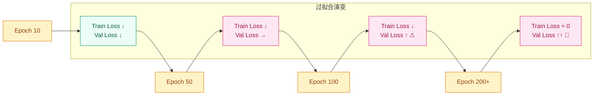
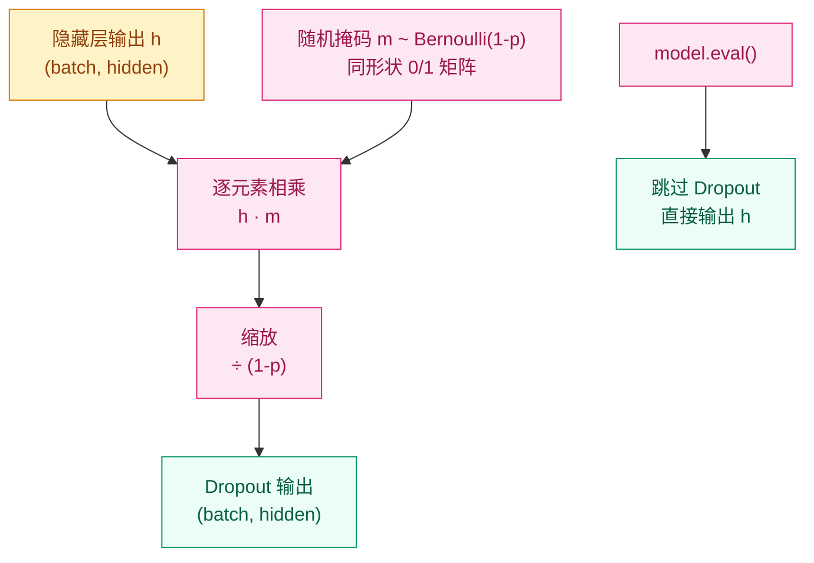

# Dropout 与正则化章节设计

## 背景

`00-Prerequisites/deep-learning-basics/` 的渐进式实现已在代码中使用 `nn.Dropout()`，但从未解释过其原理。`01-Visual-Intelligence/training/` 的 2.2 小节有约 10 行覆盖，但作为"训练稳定性"大章的子节，深度不足。Timeline 中 2012/2013/2014 三年各有 Dropout/DropConnect/Dropout-in-RNNs 条目，需要一个前置章节承接这些内容。

## 决策

- **位置**：`00-Prerequisites/regularization/README.md`（新建目录）
- **组织方式**：按技术演进线（方案 A）
- **覆盖范围**：完整专题，含 Dropout 变体

## 章节结构

```
# 为什么模型会"死记硬背"？—— 正则化与 Dropout

## 这个问题从哪来
> 2012, Hinton 组发现深度网络训练集 loss 趋零但测试集不降反升...

## 学习目标
1. 为什么大模型容易过拟合？容量和泛化的矛盾在哪？
2. Dropout 的 inverted dropout 是怎么操作的？为什么推理时要关掉？
3. L2 正则化和 Dropout 分别从什么角度抑制过拟合？
4. DropConnect / SpatialDropout / DropBlock 各自解决什么场景的问题？
5. 什么时候该用哪种正则化手段？

## 1. 直觉
- 过拟合类比：学生死记硬背考题 vs 理解原理
- Dropout 类比：蒙眼团队练习，每个人都要独立胜任
- L2 类比：给参数"减肥"，不允许任何权重过大
- 变体直觉：DropConnect 是"蒙住手脚"而非"蒙眼"

## 2. 机制

### 2.1 过拟合的诊断与根源



- 模型容量 vs 数据量的直觉公式
- > 你要记住：正则化的本质不是"让模型变差"，而是"限制有效容量"

### 2.2 Dropout：核心机制



- Inverted dropout 公式：$\tilde{h}_i = \frac{m_i \cdot h_i}{1-p}$
- 为什么用 inverted 而不是原始版本
- > 你要记住：Dropout 推理时必须关闭——它不是在给网络加噪声，是在做模型平均的近似

### 2.3 权重衰减（L2 正则化）
- 损失函数 $L_{reg} = L + \frac{\lambda}{2}\|\theta\|^2$
- 与 Dropout 的对比：参数空间约束 vs 集成学习近似
- PyTorch 中 `weight_decay` 参数的含义

### 2.4 变体演进
- DropConnect（2013, Wan et al.）：drop 权重而非激活 → 更强但更慢
- SpatialDropout（2014）：drop 整个 channel → 解决 CNN 特征图空间相关性
- DropBlock（2018）：drop 连续区域 → 适配卷积的局部相关性
- Dropout in RNNs（2014, Zaremba et al.）：只在 non-recurrent 连接上加 → 避免 LSTM/GRU 遗忘门被干扰

### 2.5 其他正则化手段（点到为止）
- Early Stopping：验证集 loss 不降就停
- Data Augmentation：最有效的正则化是更多"不同"的数据
- Label Smoothing：软化硬标签
- > 你要记住：正则化手段没有银弹，实际效果取决于数据、模型和任务的组合

### 2.6 渐进式实现
- Step 1：纯 NumPy 实现 inverted dropout（10行）
- Step 2：PyTorch `nn.Dropout` + train/eval 切换演示
- Step 3：CNN 中 SpatialDropout / DropBlock 的使用
- Step 4：对比实验——同一 MLP 在不同 dropout rate 下的 train/val loss 曲线
  ```python
  import torch, matplotlib.pyplot as plt

  torch.manual_seed(42)

  # --- 数据 ---
  X = torch.randn(1000, 20)
  y = (X[:, 0] + X[:, 1] > 0).long()
  train_X, val_X = X[:800], X[800:]
  train_y, val_y = y[:800], y[800:]

  def make_model(dropout_p):
      return torch.nn.Sequential(
          torch.nn.Linear(20, 256),
          torch.nn.ReLU(),
          torch.nn.Dropout(dropout_p),
          torch.nn.Linear(256, 256),
          torch.nn.ReLU(),
          torch.nn.Dropout(dropout_p),
          torch.nn.Linear(256, 2),
      )

  rates = [0.0, 0.2, 0.5, 0.8]
  fig, axes = plt.subplots(1, 4, figsize=(16, 4), sharey=True)

  for ax, p in zip(axes, rates):
      model = make_model(p)
      opt = torch.optim.Adam(model.parameters(), lr=1e-3)
      train_losses, val_losses = [], []

      for epoch in range(200):
          model.train()
          loss = torch.nn.functional.cross_entropy(model(train_X), train_y)
          opt.zero_grad(); loss.backward(); opt.step()
          train_losses.append(loss.item())

          model.eval()
          with torch.no_grad():
              val_loss = torch.nn.functional.cross_entropy(model(val_X), val_y)
          val_losses.append(val_loss.item())

      ax.plot(train_losses, label='train')
      ax.plot(val_losses, label='val')
      ax.set_title(f'dropout={p}')
      ax.legend()
      ax.set_xlabel('epoch')

  axes[0].set_ylabel('loss')
  plt.suptitle('不同 Dropout 率下的训练/验证 Loss 对比')
  plt.tight_layout()
  plt.savefig('dropout_comparison.png', dpi=150)
  ```

## 3. 工程陷阱
1. Dropout rate 过高 → 浅层网络欠拟合
2. 忘记 model.eval() → 推理结果随机
3. weight_decay + Adam 的互动 → AdamW 的由来
4. BatchNorm 和 Dropout 顺序不当 → 训练不稳定
5. RNN 中 Dropout 加错位置 → 长程依赖被破坏

## 演进笔记
> 正则化的遗产：从"手动加噪声"到"自适应正则"（如 BatchNorm 的隐式正则效应）。
> 留下的新问题：大模型时代（GPT-4 级别），Dropout 几乎不再使用——为什么？
→ 详见 [训练与优化](../../01-Visual-Intelligence/training/README.md)

---
**上一章**: [深度学习基础](../deep-learning-basics/README.md) | **下一章**: [训练与优化](../../01-Visual-Intelligence/training/README.md)
```

## 阅读顺序变更

```
# 变更前
deep-learning-basics → 01-Visual-Intelligence/training

# 变更后
deep-learning-basics → regularization → 01-Visual-Intelligence/training
```

## 联动更新清单

| 文件 | 改动 |
|---|---|
| `00-Prerequisites/README.md` | Phase 概览中添加 regularization 模块链接 |
| `00-Prerequisites/deep-learning-basics/README.md` | 末尾导航更新：下一章指向 `regularization`；渐进式实现中 `nn.Dropout` 处加交叉引用 |
| `01-Visual-Intelligence/training/README.md` | 2.2 小节精简为 2-3 行要点 + 交叉引用指回 `00-Prerequisites/regularization` |
| `01-Visual-Intelligence/README.md` | 确认 Phase 概览中 dropout 相关描述与新前置章节不冲突 |
| `00-Timeline/README.md` | 2012 Dropout 条目、2013 DropConnect 条目、2014 Dropout-in-RNNs 条目补充指向新模块的链接 |
| `STYLE.md` | 无需修改 |

## 不做的事

- 不修改 `01-Visual-Intelligence/sequence-models/`（只是使用 dropout 参数）
- 不修改 `01-Visual-Intelligence/cnn-architectures/`（同上）
- 不在 2.5 节展开 BatchNorm（那是 training 章节的主线内容）

## 风格规范

遵循 STYLE.md 全部规范：
- 签名三元素：`这个问题从哪来` / `你要记住`（最多 3 次） / `演进笔记`
- Mermaid 暖色方案
- 渐进式实现 4 步
- 代码三行注释头 + `torch.manual_seed(42)`
