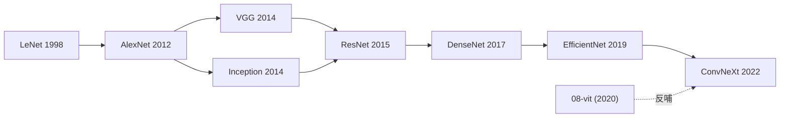

# `01-cnn` 家族内容写作 · 设计

**日期**：2026-06-07
**作者**：通过 brainstorming 共同确定
**状态**：Design Approved，等待写实施计划

---

## 1. 背景

仓库结构、风格指南、AlexNet 金标本均已就位（前序 specs：`2026-06-06-repo-restructure-by-architecture-families-design.md`、`2026-06-07-writing-style-guide-design.md`、`2026-06-07-node-depth-and-figures-design.md`）。本 spec 是**第一份家族内容 spec**——把 `01-cnn` 家族的 6 个新节点 + 1 个家族 README 落地，让 CNN 这条线从仓库骨架变成有内容的家族。

写作风格 / 章节模板 / 图规范 / frontmatter 契约均已锁死。本 spec 只回答"01-cnn 内容怎么落地"的具体决定，不再调风格规则。

## 2. 核心决策

| # | 决策 | 选项 |
|---|------|-----|
| 1 | 节点清单 | **B：7 节点（含 ConvNeXt 收尾）**——LeNet · AlexNet（已完成）· VGG · Inception · ResNet · DenseNet · EfficientNet · ConvNeXt |
| 2 | 节点类型分级 | LeNet=1 概念引入型；VGG/DenseNet/ConvNeXt=标准；Inception/EfficientNet=标准+工程陷阱；ResNet=**大事件** |
| 3 | ResNet 的 SVG | **B：暂用 2 张 Mermaid**（粗架构 + BasicBlock/Bottleneck 细节），SVG 标记 `<!-- TODO(SVG) -->`，留待后续 plan |
| 4 | archive 使用 | **C：subagent 不读 archive 全文**，brief 里只提供从 archive 摘出的事实清单 bullets |
| 5 | 家族 README 时机 | **C：plan 最后一个 Task**（节点写完后，从节点正文提炼子时间线） |
| 6 | 执行顺序 | 按时间排序（LeNet → VGG → Inception → ResNet → DenseNet → EfficientNet → ConvNeXt → README → 冒烟） |

## 3. 节点清单与分级

| Order | 文件 | 工作名 (年份) | 类型 | 字数目标 | 图配额 | 可选块展开 |
|------|------|------|------|--------|--------|----------|
| 01 | `01-lenet.md` | LeNet (1998) | 1 概念引入型 | 800–1500 | ≥1 Mermaid | 无（不拆 ### 直觉/机制；不加 ## 工程陷阱；不加 ## 训练细节） |
| 02 | `02-alexnet.md` ✅ | AlexNet (2012) | 标准 | 已完成（1988 字） | ✅ | 训练细节 ✅ |
| 03 | `03-vgg.md` | VGG (2014) | 标准 | 2000–3500 | ≥1 Mermaid | 训练细节 |
| 04 | `04-inception.md` | GoogLeNet / Inception v1 (2014) | 标准 | 2000–3500 | ≥1 Mermaid | 工程陷阱（辅助分类器、分支选择）+ 训练细节 |
| 05 | `05-resnet.md` | ResNet (2015) | **大事件** | 3000–5000 | ≥2 张 Mermaid（粗架构 + BasicBlock/Bottleneck 细节）+ SVG TODO 注释 | 直觉/机制 + 训练细节 |
| 06 | `06-densenet.md` | DenseNet (2017) | 标准 | 2000–3500 | ≥1 Mermaid | 训练细节 |
| 07 | `07-efficientnet.md` | EfficientNet (2019) | 标准 | 2000–3500 | ≥1 Mermaid | 工程陷阱（复合缩放调参）+ 训练细节 |
| 08 | `08-convnext.md` | ConvNeXt (2022) | 标准 | 2000–3500 | ≥1 Mermaid | 训练细节 |

## 4. 每个节点的写作 brief 模板

每个 Task brief 给 subagent 的输入包含以下 5 部分：

### 4.1 风格锚
- 金标本路径：`01-cnn/02-alexnet.md`（必须读一遍）
- 风格指南：`docs/writing-style.md`（特别 §1 节点规范）
- 技术约定：`docs/tech-conventions.md`

### 4.2 节点元信息
- 完整 frontmatter（7 字段值，含 `key_idea` ≤ 80 字）
- 节点类型 + 字数目标 + 图配额 + 可选块展开清单

### 4.3 事实清单（从 archive 摘）

每个节点 brief 含 4–8 个 bullet，包括：

- 关键数字（具体 Top-5、参数量、训练时间等）
- 论文细节（作者、首版年份、关键引用）
- 历史钩子（用户已在 archive 里整理过的判断句，如"训练误差先降后升"）
- 关键超参（若展开 `## 训练细节`，则列出 lr/momentum/wd/batch 等）

这些 bullet 由 controller（写 plan 的 Claude）从 `_archive/tracks/vision/cnn-architectures/README.md` 预先摘出，写进 Task brief。**subagent 不读 archive 全文**，避免风格污染。

### 4.4 引用清单（传球目标）

每个节点的 `## 影响 / 后续` 段必须以 `→ 链接` 结尾。brief 里给出至少 2 个目标链接：

- 同家族下一节点（如 `02-alexnet.md` → `03-vgg.md`）
- foundations 横切（如 `../foundations/02-activations/`）
- 跨家族（如 `../08-vit/`，仅在确实有延伸时给）

### 4.5 不展开清单

明确告诉 subagent 该节点**不要展开**哪些可选块。例如：

- LeNet 不展开 `### 直觉` / `### 机制` / `## 工程陷阱` / `## 训练细节`
- VGG 不展开 `### 直觉` / `### 机制` / `## 工程陷阱`（只加 `## 训练细节`）
- ResNet **展开** `### 直觉` / `### 机制` 和 `## 训练细节`（其他不展开）

## 5. 每个节点 Task 的自动校验

每个节点 Task 收尾跑同一套 grep 校验（仿 AlexNet 的 13 项）：

1. H1 标题 `# {{ name }} ({{ year }})` 命中
2. frontmatter 7 字段齐全（grep count = 7）
3. 「你要记住」出现 0–2 次（按可选钩子规则）
4. `## 影响 / 后续` 段 `→` 链接计数 ≥ 2
5. foundations 引用 ≥ 1 处
6. 图配额满足（Mermaid `^\`\`\`mermaid` 起始数量符合分级）
7. 图 caption `^\*图 N：` 数量 = Mermaid 数量
8. 字数在 [字数下限 × 0.7, 字数上限 × 1.3] 范围内
9. 不展开块的 grep 校验（按 §4.5 brief 列出的清单，相应章节不应出现）
10. 展开块的 grep 校验（应展开的章节应出现）

每个 Task 跑完后重生成 `TIMELINE.md`，确认条目数递增。

## 6. 家族 README（Task 8）

7 个节点全部完工后，写 `01-cnn/README.md`：

### 6.1 章节（按 writing-style §2.1）

```
# CNN 卷积神经网络
> {{ one_line_positioning }}

## 一句话定位          (100-250 字)
## 概念本身            (300-600 字，含家族级 Mermaid 演进图)
## 子时间线            (表格 8 行：LeNet → ... → ConvNeXt)
## 依赖与延伸          (前置 foundations 3-6 条；延伸家族 1-3 条)
```

### 6.2 子时间线表格内容

| 年份 | 名字 | 关键贡献 | 之前卡在哪 |
|------|------|---------|-----------|
| 1998 | [LeNet](01-lenet.md) | 定义卷积+池化+全连接范式 | MLP 把图像压平丢失邻域信息 |
| 2012 | [AlexNet](02-alexnet.md) | 深 CNN + ReLU + Dropout + 双 GPU 训练 | 手工特征 Top-5 卡 26% |
| 2014 | [VGG](03-vgg.md) | 纯 3×3 堆叠，深度即正义 | 网络该深到哪、用什么 kernel 没共识 |
| 2014 | [Inception](04-inception.md) | 多分支并行 + 1×1 降维 | VGG 参数量太大、计算昂贵 |
| 2015 | [ResNet](05-resnet.md) | 残差连接终结深度退化 | 20 层之后训练误差反而上升 |
| 2017 | [DenseNet](06-densenet.md) | 稠密连接，每层接收所有前层 | ResNet 的"加法"还可以更激进 |
| 2019 | [EfficientNet](07-efficientnet.md) | 复合缩放，精度 × 效率帕累托最优 | depth/width/resolution 怎么平衡靠人手调 |
| 2022 | [ConvNeXt](08-convnext.md) | 用 ViT 设计哲学反哺纯 CNN | CNN 被 ViT 抢走主线后能否反扑 |

### 6.3 家族级 Mermaid 演进图

按时间排出 8 个节点 + 关键标签：



### 6.4 依赖与延伸

**前置（foundations）：**
- `../foundations/01-neural-network-basics/`
- `../foundations/02-activations/`
- `../foundations/03-optimizers/`
- `../foundations/04-normalization/`
- `../foundations/07-regularization/`

**通向哪些家族：**
- `../04-gan/` — 把转置卷积应用到生成
- `../08-vit/` — Transformer 接管视觉主线
- `../10-diffusion/` — UNet 这种 CNN 变体成扩散模型骨架

## 7. 冒烟（Task 9）

```bash
# 8 节点 frontmatter 7 字段齐全
for f in 01-cnn/[0-9][0-9]-*.md; do
  test $(head -10 "$f" | grep -cE "^(name|year|family|order|paper|authors|key_idea):") -eq 7 || echo "FAIL: $f"
done

# README 4 必填章节
grep -nE "^## (一句话定位|概念本身|子时间线|依赖与延伸)" 01-cnn/README.md | wc -l   # ≥ 4

# TIMELINE 重生成正常
python3 scripts/generate_timeline.py   # 期望 "wrote ... (8 nodes)"

# 测试仍正常
python3 -m pytest scripts/test_generate_timeline.py -v 2>&1 | tail -3   # 2 passed

# 工作树干净
git status -s   # 仅未追踪本地
```

## 8. 不在本次范围内

- `foundations/` 子模块的内容（仍是 stub README；节点引用它们的链接合规，但跳过去看到的是 stub）
- ResNet 的 SVG 精品图（标记 TODO，留作单独 plan）
- 其他 14 个家族的内容
- Web 端联动

## 9. 验收标准

1. ✅ 8 个节点文件存在并通过自动校验（grep + 长度 + 图配额）
2. ✅ AlexNet 节点保持现状（不动）
3. ✅ `01-cnn/README.md` 4 必填章节齐全 + 含家族级演进 Mermaid 图
4. ✅ `TIMELINE.md` 重生成后报告 `8 nodes`
5. ✅ `scripts/test_generate_timeline.py` 仍 2/2 PASS
6. ✅ 所有节点的 `## 影响 / 后续` 至少 2 个 `→` 链接
7. ✅ 工作树干净（除 `.claude/` 等本地未追踪）
