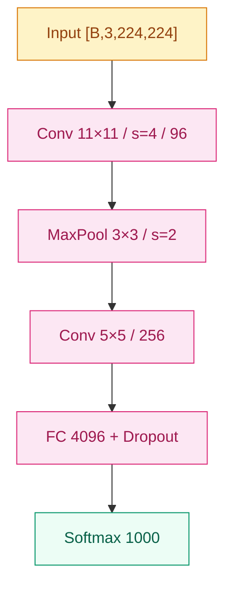

# 节点深度提升 + 图规范 · 设计

**日期**：2026-06-07
**作者**：通过 brainstorming 共同确定
**状态**：Design Approved，等待写实施计划
**关系**：本 spec 是 `2026-06-07-writing-style-guide-design.md` 的补丁/修订。AlexNet 金标本落地后，发现节点深度不够、且完全缺图——本 spec 把这两件事补齐。

---

## 1. 背景

上一份 spec（`2026-06-07-writing-style-guide-design.md`）把节点的章节结构、调性、跨引用规范、frontmatter 契约都定下来，并以 AlexNet 为金标本落地。但金标本写完后两个问题暴露：

1. **技术细节缺失** —— LRN、双 GPU 切分、超参数（lr/momentum/weight decay/dropout/batch）、数据增强细节、训练时长、历年 ImageNet 错误率，这些"搞清这工作必备的事实"都没进去。现有 4 必填 + 2 可选章节结构没有合适的归位。
2. **完全没有图** —— 没有架构图、没有概念示意图、没有可视化标注。100+ 节点纯文字无图，可读性远低于教科书水准。

由于 AlexNet 是金标本，**它的形态直接定义全项目 100+ 节点的标准**。改 AlexNet 即改风格指南。

## 2. 核心决策（沿用前后回答的字母）

| # | 决策 | 选项 |
|---|------|-----|
| 1 | 图的格式 | **B：Mermaid 默认 + SVG 特技**（不引入 matplotlib/PNG，复杂可视化交给 Web 端） |
| 2 | 节点图配额分级 | **C：按节点长度分级**（1 概念 ≥1 张 / 标准 ≥1 张 / 大事件 ≥2 张含至少 1 张 SVG） |
| 3 | 新增章节装"训练细节" | **A：加 `## 训练细节` 为可选块**（独立于"工程陷阱"） |
| 4 | SVG 文件存放约定 | **B：家族级 `assets/` + 节点编号前缀**（`01-cnn/assets/02-alexnet-arch.svg`） |
| 5 | 图标号与标题 | `*图 N：...*` 斜体一行，节点 / 家族 README 内连续编号 |
| 6 | SVG 创作路径 | 手写 SVG，视觉语言对齐 web `CnnTrack.tsx`；本期不抽取共享 |
| 7 | Mermaid 节点标签约束 | 计算节点必含 op + 关键超参；首末节点必含 tensor shape `[B, C, H, W]` |

## 3. 风格指南文件改动详情

### 3.1 `docs/writing-style.md` §1（节点规范）

#### §1.1 章节结构升级（从 4+2 扩为 4+3）

```
[frontmatter 7 字段，详 tech-conventions.md §3]

# {{ name }} ({{ year }})              ← H1 中性标题

## 之前卡在哪                          [必填] · 60-200 字
## 核心思想                            [必填]
    ### 直觉                           [可选 ###]
    ### 机制                           [可选 ###]
## 工程陷阱                            [可选 ##]
## 训练细节                            [可选 ##]   ← 新增
## 关键代码                            [必填] · 一个 fenced PyTorch 块
## 影响 / 后续                          [必填] · 必须以 "→ 链接" 结尾
```

`## 训练细节` 装什么：

- 关键超参（lr / momentum / weight decay / dropout / batch size / 优化器选择）
- 数据增强（裁剪、翻转、颜色扰动、Mixup/CutMix 等）
- 测试时增强（TTA）
- 训练资源 / 时长（如 "5 天 × 2 × GTX 580"）
- 关键基准数据点（如 ImageNet Top-5 错误率年表、消融实验代表性结果）

#### §1.2 何时展开各可选块（判断表更新）

| 工作类型 | `### 直觉/机制` | `## 工程陷阱` | `## 训练细节` |
|---|---|---|---|
| 1 概念引入型（LeNet · GRU） | 不拆 | 否 | 否 |
| 标准节点（AlexNet · VGG · DenseNet） | 看情况 | 看情况 | **加**（如果有标志性超参可考） |
| 大事件节点（ResNet · Transformer · GPT-3） | 拆 | 看情况 | **加** |
| 概念/理论型（LayerNorm） | 看情况 | 看情况 | 否（无标志性超参） |
| 历史已模糊（如非常早期工作） | 不拆 | 否 | 否 |

#### §1.5 长度目标（上调）

| 节点类型 | 旧目标 | 新目标 |
|---|---|---|
| 1 概念引入型 | 800–1500 字 | **800–1500 字**（不变） |
| 标准节点 | 1500–2500 字 | **2000–3500 字** |
| 大事件节点 | 2500–4000 字 | **3000–5000 字** |
| 升级文件夹阈值 | 4000 字 | **5000 字** |

#### §1.6 图的规范（新增整节）

**配额（按节点类型分级）：**

```
节点必填图配额：
  · 1 概念引入型: ≥ 1 张 Mermaid（架构图，含 shape 标注）
  · 标准节点:     ≥ 1 张 Mermaid（架构图，含 shape 标注）
  · 大事件节点:   ≥ 2 张图，至少 1 张 SVG（用于核心创新可视化）

家族 README 必填图配额：
  · 1 张 Mermaid（家族级演进图，按时间排出该家族所有节点）

foundations 必填图配额：
  · 0 张（图可选；公式才是主菜）
```

**图标号与标题：**

```markdown
\`\`\`mermaid
... 图本体 ...
\`\`\`
*图 1：AlexNet 5 conv + 3 fc 主干，含每层 shape 标注。*


*图 2：残差块结构。`F(x) + x` 让深层网络可训练。*
```

- `*图 N：...*` 斜体一行，紧跟图本体
- 编号在单个节点 / 单个家族 README 内连续：图 1、图 2、图 3
- 标题 ≤ 30 字，说"看什么"而不是"怎么画"
- 跨节点不复用编号

**SVG 引用语法：**

```markdown
<!-- 节点内引用同家族 assets -->


<!-- 家族 README 引用同家族 assets -->

```

**Mermaid 架构图模板（必照此调）：**



约束（subagent 写作时遵守）：

- 每个**计算节点**标签必须含 **操作 + 关键超参**（如 `Conv 11×11 / s=4 / 96`、`FC 4096`）
- **首末节点**（input/output）标签必须含 **tensor shape**（`[B, C, H, W]` 或 `[B, T, D]`）
- `classDef` 颜色遵守 `tech-conventions.md §1` 配色
- 默认 `graph TD`，连线灰 `#d6d3d1`

### 3.2 `docs/tech-conventions.md` §1（Mermaid 配色）

§1 末尾增加约束条目（不改色板）：

```markdown
**Mermaid 节点标签约束（节点架构图）：**

- 计算节点：必含操作名 + 关键超参，例 `Conv 11×11 / s=4 / 96`
- 首末节点（input/output）：必含 tensor shape，例 `Input [B,3,224,224]`
- 详见 `writing-style.md §1.6` 的架构图模板
```

### 3.3 `docs/templates/node.md`

在现有可选块区域加 `## 训练细节` 的 HTML 注释提示：

```markdown
<!--
## 训练细节
（可选二级标题。装关键超参、数据增强、训练资源/时长、基准数据点。
适用于有具体超参可考的历史里程碑或现代工作。例如 AlexNet / ResNet / GPT-3。）
-->
```

在 `## 影响 / 后续` 之前的位置插入（与 `## 工程陷阱` 注释并排）。

### 3.4 SVG 文件存放约定

写入 `tech-conventions.md §4 文件命名`：

```markdown
## 4. 文件命名

... 已有内容 ...

### 4.5 图资产文件命名

- 节点专属 SVG：`<family>/assets/<NN>-<node-name>-<purpose>.svg`
  - 例：`01-cnn/assets/02-alexnet-arch.svg`、`01-cnn/assets/05-resnet-residual.svg`
- 家族级 SVG：`<family>/assets/<purpose>.svg`（不带节点前缀）
  - 例：`01-cnn/assets/family-evolution.svg`
- 单个家族 assets 目录承担本家族所有图，按节点编号前缀排序
- 全部 ASCII 小写 + 连字符
```

## 4. AlexNet 金标本重写规格

新版 AlexNet（路径 `01-cnn/02-alexnet.md`）必须落实下面**所有**要素：

### 4.1 章节展开

- 4 必填章节齐全
- **新增展开 `## 训练细节`**（这是标准节点 + 有标志性超参的典型场景）
- **不展开** `### 直觉` / `### 机制` 和 `## 工程陷阱`（保留"小节点示范"语义；技术细节挪去 `## 训练细节`）

### 4.2 内容补充（相对当前版本）

| 类目 | 当前版本是否有 | 新版本要求 |
|------|----------|--------|
| SIFT/HOG 时代背景 | 有 | 保留 |
| Top-5 ~26% 数字 | 有 | 保留 + 加 ImageNet 历年表对照 |
| 卷积公式 | 有 | 保留 |
| Softmax + CE 公式 | 有 | 保留 |
| ReLU 解释 | 有（轻描淡写） | 保留 |
| Dropout 解释 | 有 | 保留 |
| 数据增强 | 笼统提了 | **拆开讲**：224 random crop from 256 / 左右翻转 / PCA 颜色扰动 |
| **LRN（局部响应归一化）** | 没讲 | **新增**（机制 + 为什么后来弃用） |
| **双 GPU 切分** | 没讲 | **新增**（架构图标出 + 一句话工程动机） |
| **感受野计算** | 没讲 | **新增**（简表：每层 RF 大小） |
| **超参**（lr 0.01、momentum 0.9、wd 5e-4、dropout 0.5、batch 128） | 没讲 | **新增**到 `## 训练细节` |
| **训练资源**（5 天 × 2 GTX 580、CUDA 实现） | 没讲 | **新增** |
| **TTA**（10-crop averaging） | 没讲 | **新增** |
| **ImageNet 年表** 2010 28.2% → 2011 25.8% → 2012 AlexNet 16.4%（单模型 18.2%、5-model ensemble 16.4%、+预训练 15.3%） | 没讲 | **新增**（小表格） |
| 「你要记住」钩子 | 1 次 | 保留 |
| 影响 / 后续 → 链接 | 3 个 | 保留 + 可酌情加 1 个 |

### 4.3 图

最少 1 张 Mermaid 架构图（standard 节点配额）。建议结构：

- 节点：input → 5 个 conv + 3 个 pool → flatten → 3 个 fc → softmax
- 每个计算节点标签：op + kernel/stride/channels
- 首末节点：shape 标注
- 配色按 tech-conventions §1
- caption：`*图 1：AlexNet 主干结构（5 conv + 3 fc），shape 标注在 input/output 节点。*`

可选追加：1 张感受野累积示意 SVG（若手写成本可控）。本期不强求。

### 4.4 长度目标

- 标准节点新目标 2000–3500 字（±30% = 1400–4550 字）
- 当前版本 1250 字 → 新版应到 ~2800 字

### 4.5 frontmatter

保持不变（7 字段已齐全，AlexNet 已落实）。`key_idea` 不需要重写。

## 5. 改动清单（影响的文件）

| 文件 | 改动 |
|------|----|
| `docs/writing-style.md` | §1.1 加 `## 训练细节`；§1.2 判断表更新；§1.5 长度目标上调；新增 §1.6 图的规范 |
| `docs/tech-conventions.md` | §1 增加 Mermaid 标签约束；§4 增加 §4.5 图资产命名 |
| `docs/templates/node.md` | 加 `## 训练细节` 可选块注释 + 架构图位置提示 |
| `01-cnn/02-alexnet.md` | 重写为新金标本（4 必填 + `## 训练细节` + Mermaid 架构图，2000–3500 字） |
| `01-cnn/assets/` | 新建（如果有 SVG 才需要；本期 AlexNet 不强求 SVG） |
| `docs/superpowers/specs/2026-06-07-node-depth-and-figures-design.md` | 本文件 |

## 6. 不在本次范围内

- 其他家族 / 节点的内容（仍由后续每家族 content plan 完成）
- Web 端 mini-arch SVG 抽取（标记为未来工作）
- AlexNet 之外的金标本（仍只 1 个金标本）
- foundations 模块的图规范细化（本期 foundations 图仍是 0 张配额）

## 7. 验收标准

1. ✅ `docs/writing-style.md` §1 更新完整（章节集合 / 判断表 / 长度 / §1.6 图规范）
2. ✅ `docs/tech-conventions.md` §1 + §4.5 更新
3. ✅ `docs/templates/node.md` 加新可选块注释
4. ✅ `01-cnn/02-alexnet.md` 重写后：
   - 含 `## 训练细节` 章节，涵盖超参 / 数据增强 / 训练资源 / TTA / ImageNet 年表
   - 含 LRN、双 GPU 切分、感受野计算的描述
   - 含 1 张 Mermaid 架构图 + caption（编号 `图 1`）
   - 长度在 2000–3500 字 ±30% 范围内
   - 不含 `### 直觉` / `### 机制` / `## 工程陷阱`（保留小节点示范语义）
   - frontmatter 不变
5. ✅ `TIMELINE.md` 重新生成后正常显示 AlexNet 行（key_idea 不变）
6. ✅ `scripts/test_generate_timeline.py` 仍 2/2 PASS
