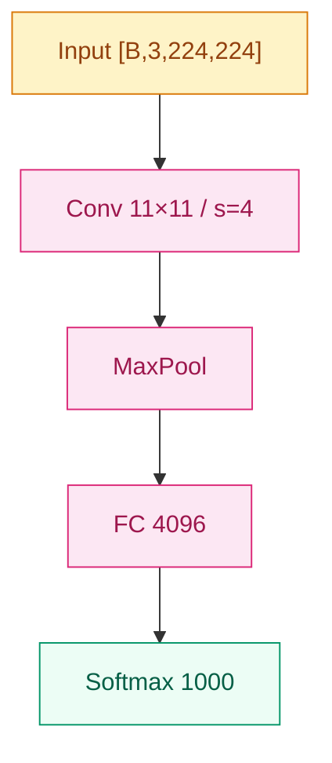

# Daily-LLM · 技术约定

> Mermaid 配色、代码规范、frontmatter 契约、文件命名。
> 写内容的风格 → `writing-style.md`。
> 项目元信息 → `../AGENTS.md`。

## 1. Mermaid 配色（全仓库统一）

所有 Mermaid 图必须沿用以下五类语义色：

| 语义 | fill | stroke | color |
|------|------|--------|-------|
| 输入 / 数据 | `#fef3c7` | `#d97706` | `#92400e` |
| 计算 / 变换 | `#fce7f3` | `#db2777` | `#9d174d` |
| 输出 / 结果 | `#ecfdf5` | `#059669` | `#065f46` |
| 问题 / 局限 | `#fff7ed` | `#ea580c` | `#9a3412` |
| 演进 / 链接 | `#eff6ff` | `#2563eb` | `#1e40af` |

约定：

- 架构图默认 `graph TD`
- 连线灰 `#d6d3d1`
- 节点上标注 tensor shape，如 `[B, C, H, W]`
- 跨家族对比图允许用"演进 / 链接"色把不同家族标出

**Mermaid 节点标签约束（节点架构图）：**

- 计算节点：必含操作名 + 关键超参，例 `Conv 11×11 / s=4 / 96`
- 首末节点（input/output）：必含 tensor shape，例 `Input [B,3,224,224]`
- 详见 `writing-style.md §1.6` 的架构图模板

示例片段：



## 2. Python / PyTorch 代码规范

### 2.1 文件头与注释

- 文件头 docstring：`"""模块名 · 路径 · 核心 1-2 句 · 关键依赖"""`
- 函数三行注释头，无前缀标签，直接写内容：

```python
# 按相关性做加权聚合
# softmax(QK^T / √d_k) @ V
# 时间 O(n²d)，空间 O(n²)
def scaled_dot_product_attention(q, k, v, mask=None):
    ...
```

### 2.2 Shape 标注

Docstring 的 Args 必须标注 shape：

```python
"""
Args:
    q: (batch, heads, seq, d_k)
    k: (batch, heads, seq, d_k)
    v: (batch, heads, seq, d_v)
    mask: (batch, 1, seq, seq) 或 None
Returns:
    out: (batch, heads, seq, d_v)
"""
```

### 2.3 其它

- 魔法数字命名为常量，不要散落在表达式里
- 随机种子统一 `torch.manual_seed(42)`
- 格式化：Black，行宽 88
- 不使用 `from xxx import *`

### 2.4 节点 `## 关键代码` 块的额外要求

- 必须**单文件可跑**——不依赖未定义的 import；如需 PyTorch，`import torch` 显式写出
- 核心机制 ≤ 30 行能讲清就别堆样板（数据加载、训练循环之类省掉）
- fenced 块上一行用 1 行注释说"这段在演示什么"，例如：

````markdown
下面这段演示残差块的最小骨架，关键是 `out = F(x) + x` 这一行：

```python
import torch
import torch.nn as nn

class ResidualBlock(nn.Module):
    def __init__(self, c):
        super().__init__()
        self.f = nn.Sequential(
            nn.Conv2d(c, c, 3, padding=1),
            nn.BatchNorm2d(c),
            nn.ReLU(inplace=True),
            nn.Conv2d(c, c, 3, padding=1),
            nn.BatchNorm2d(c),
        )

    def forward(self, x):
        return torch.relu(self.f(x) + x)
```
````

## 3. frontmatter 契约（节点专属）

每个节点 markdown 文件顶部必须有 7 字段 frontmatter：

```yaml
---
name: "工作名（英文或惯用名）"
year: 2015
family: "01-cnn"
order: 5
paper: "完整论文标题"
authors: ["He Kaiming", "Zhang Xiangyu"]
key_idea: "≤ 80 字的一句话核心"
---
```

规则：

- **7 字段全部出现**（值可为空字符串/空数组，但字段必须在）
- `key_idea` ≤ 80 字（这句会显示在自动生成的 `TIMELINE.md` 表格里）
- `order` 与文件名前缀一致：`05-resnet.md` → `order: 5`
- `family` 与所在家族目录一致：`01-cnn/05-resnet.md` → `family: "01-cnn"`
- `year` 用首次发表年（arXiv 首版优先，会议版年份次之）
- `authors` 是数组，可空 `[]`；姓名用论文署名顺序

**家族 README / foundations 模块不写 frontmatter**——它们不参与 `TIMELINE.md` 生成，生成脚本 `scripts/generate_timeline.py` 仅扫描根目录下匹配 `^\d{2}-[a-z0-9\-]+$` 的家族目录。

## 4. 文件命名

- 家族目录：`NN-kebab-case`，如 `01-cnn`、`06-bert-family`
- 节点文件：`NN-kebab-case.md`，编号与 frontmatter `order` 一致
- 节点目录形态（升级版）：`NN-kebab-case/README.md` + 配套资源
- foundations 子目录：`NN-kebab-case`，如 `02-activations`、`08-attention-mechanism`
- 全部 ASCII 小写 + 连字符；不要下划线，不要中文文件名，不要驼峰

### 4.5 图资产文件命名

- 节点专属 SVG：`<family>/assets/<NN>-<node-name>-<purpose>.svg`
  - 例：`01-cnn/assets/02-alexnet-arch.svg`、`01-cnn/assets/05-resnet-residual.svg`
- 家族级 SVG：`<family>/assets/<purpose>.svg`（不带节点前缀）
  - 例：`01-cnn/assets/family-evolution.svg`
- 单个家族 assets 目录承担本家族所有图，按节点编号前缀排序
- 全部 ASCII 小写 + 连字符

## 5. 跨家族 / foundations 引用语法

详见 `writing-style.md` §1.4。本文档不重复，避免双正本。
